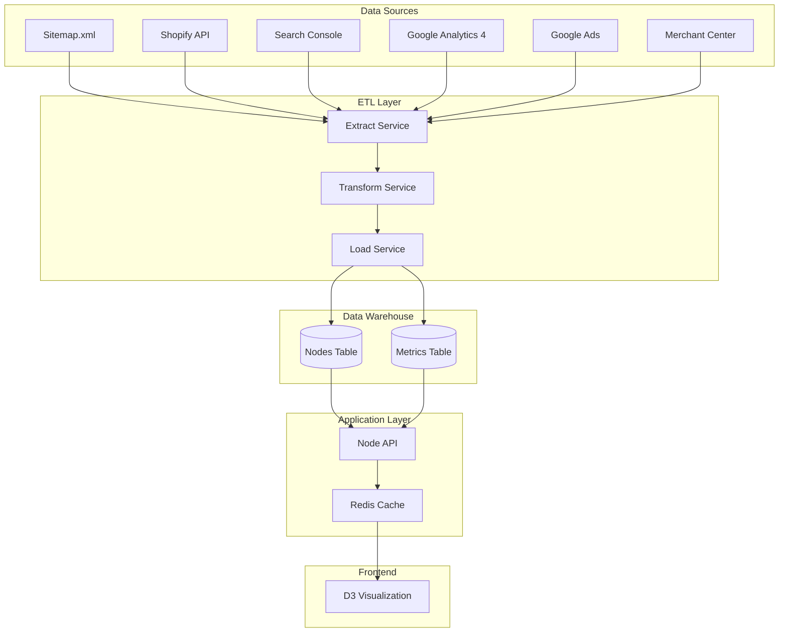

# Node-Centric Architecture for Revenue Optimization Platform

## Core Architectural Principles

### 1. Single Source of Truth for Nodes

**Principle**: Always derive nodes (categories, subcategories, brands) from a canonical dataset (sitemap or Shopify product taxonomy). External feeds only enrich, never define structure.

### 2. Feed-Agnostic Enrichment

**Principle**: Each external feed (GSC, GA4, Ads, Merchant Center, Shopify) enriches nodes but never defines them. Missing/partial feeds don't break the system.

### 3. Decoupled ETL Layer

**Principle**: Normalize and join data in a data warehouse. The frontend only queries pre-joined, node-centric data — no live API wrangling.

## Data Architecture

### Node-Centric Data Model

```sql
-- Core node entity (single source of truth)
CREATE TABLE nodes (
    node_id UUID PRIMARY KEY DEFAULT gen_random_uuid(),
    project_id UUID REFERENCES projects(id),
    url TEXT NOT NULL, -- Canonical URL from sitemap
    parent_node_id UUID REFERENCES nodes(node_id),
    type TEXT CHECK (type IN ('category', 'subcategory', 'brand', 'product', 'page')),
    title TEXT NOT NULL,
    path TEXT NOT NULL, -- URL path for hierarchy
    depth INTEGER NOT NULL DEFAULT 0,
    meta_title TEXT,
    meta_description TEXT,
    canonical_source TEXT CHECK (canonical_source IN ('sitemap', 'shopify', 'manual')),
    shopify_handle TEXT, -- For Shopify mapping
    shopify_collection_id TEXT,
    created_at TIMESTAMP DEFAULT NOW(),
    updated_at TIMESTAMP DEFAULT NOW(),
    UNIQUE(project_id, url),
    INDEX idx_nodes_path (path),
    INDEX idx_nodes_parent (parent_node_id)
);

-- Flexible metrics storage (time-series capable)
CREATE TABLE metrics (
    metric_id UUID PRIMARY KEY DEFAULT gen_random_uuid(),
    node_id UUID REFERENCES nodes(node_id) ON DELETE CASCADE,
    source TEXT NOT NULL, -- 'gsc', 'ga4', 'ads', 'shopify', 'merchant'
    date DATE NOT NULL,
    metric_key TEXT NOT NULL, -- 'impressions', 'ctr', 'revenue', etc.
    metric_value DECIMAL(20,4),
    metadata JSONB, -- Additional context (device, query, etc.)
    created_at TIMESTAMP DEFAULT NOW(),
    INDEX idx_metrics_lookup (node_id, source, date, metric_key),
    INDEX idx_metrics_date (date),
    UNIQUE(node_id, source, date, metric_key, metadata)
);

-- Node relationships (for complex taxonomies)
CREATE TABLE node_relationships (
    id UUID PRIMARY KEY DEFAULT gen_random_uuid(),
    from_node_id UUID REFERENCES nodes(node_id),
    to_node_id UUID REFERENCES nodes(node_id),
    relationship_type TEXT, -- 'parent', 'related', 'cross_sell'
    strength DECIMAL(3,2) DEFAULT 1.0,
    INDEX idx_relationships (from_node_id, relationship_type)
);

-- Feed sync status tracking
CREATE TABLE feed_sync_status (
    id UUID PRIMARY KEY DEFAULT gen_random_uuid(),
    project_id UUID REFERENCES projects(id),
    feed_type TEXT NOT NULL,
    last_sync_at TIMESTAMP,
    next_sync_at TIMESTAMP,
    status TEXT CHECK (status IN ('pending', 'syncing', 'completed', 'failed')),
    error_message TEXT,
    records_processed INTEGER DEFAULT 0,
    created_at TIMESTAMP DEFAULT NOW()
);
```

## ETL Pipeline Architecture

### Data Flow



### ETL Services Implementation

```typescript
// lib/etl/extractors/base-extractor.ts
export abstract class BaseExtractor {
  abstract extract(config: ExtractorConfig): Promise<RawData>;
  abstract validate(data: RawData): ValidationResult;
  abstract getJoinKey(record: any): string; // Usually URL
}

// lib/etl/extractors/sitemap-extractor.ts
export class SitemapExtractor extends BaseExtractor {
  async extract(config: ExtractorConfig): Promise<NodeData[]> {
    const sitemap = await this.fetchSitemap(config.sitemapUrl);
    const nodes = this.parseToNodes(sitemap);

    return nodes.map((node) => ({
      url: this.normalizeUrl(node.loc),
      title: this.extractTitle(node),
      type: this.inferType(node.loc),
      path: new URL(node.loc).pathname,
      depth: this.calculateDepth(node.loc),
      lastmod: node.lastmod,
      priority: node.priority,
      changefreq: node.changefreq,
    }));
  }

  private inferType(url: string): NodeType {
    const path = new URL(url).pathname;

    if (path.match(/\/products?\//)) return 'product';
    if (path.match(/\/collections?\/.*\/.*$/)) return 'subcategory';
    if (path.match(/\/collections?\//)) return 'category';
    if (path.match(/\/brands?\//)) return 'brand';

    return 'page';
  }
}

// lib/etl/transformers/metric-transformer.ts
export class MetricTransformer {
  transform(source: string, rawData: any[], nodes: Node[]): Metric[] {
    const nodeMap = new Map(nodes.map((n) => [n.url, n.node_id]));
    const metrics: Metric[] = [];

    for (const record of rawData) {
      const nodeId = this.matchNode(record, nodeMap);

      if (!nodeId) {
        this.logUnmatched(record);
        continue;
      }

      metrics.push(...this.extractMetrics(nodeId, source, record));
    }

    return metrics;
  }

  private matchNode(record: any, nodeMap: Map<string, string>): string | null {
    // Try exact URL match
    const url = this.normalizeUrl(record.url || record.landing_page || record.page);
    if (nodeMap.has(url)) return nodeMap.get(url);

    // Try fuzzy matching
    return this.fuzzyMatch(url, nodeMap);
  }

  private extractMetrics(nodeId: string, source: string, record: any): Metric[] {
    const date = this.parseDate(record.date);
    const metrics: Metric[] = [];

    // Map source-specific fields to standard metrics
    const mapping = this.getMetricMapping(source);

    for (const [sourceField, metricKey] of Object.entries(mapping)) {
      if (record[sourceField] !== undefined) {
        metrics.push({
          node_id: nodeId,
          source,
          date,
          metric_key: metricKey,
          metric_value: record[sourceField],
          metadata: this.extractMetadata(source, record),
        });
      }
    }

    return metrics;
  }
}
```

## Onboarding Flow Implementation

### Step-by-Step Onboarding

```typescript
// lib/onboarding/onboarding-service.ts
export class OnboardingService {
  async startOnboarding(projectId: string): Promise<OnboardingState> {
    return {
      projectId,
      steps: [
        { id: 'connect', status: 'pending', required: true },
        { id: 'discover', status: 'pending', required: true },
        { id: 'stitch', status: 'pending', required: false },
        { id: 'visualize', status: 'pending', required: true },
      ],
      currentStep: 'connect',
    };
  }

  // Step 1: Connect Accounts
  async connectAccounts(projectId: string, connections: ConnectionConfig) {
    const results = await Promise.allSettled([
      this.connectGoogle(connections.google),
      this.connectShopify(connections.shopify),
      this.fetchSitemap(connections.sitemapUrl),
    ]);

    // Even if some fail, continue with what we have
    const successful = results.filter((r) => r.status === 'fulfilled');

    if (successful.length === 0) {
      throw new Error('At least one data source required');
    }

    return this.updateOnboardingStep(projectId, 'discover');
  }

  // Step 2: Auto-discovery
  async autoDiscover(projectId: string): Promise<DiscoveryResult> {
    // Get canonical nodes from sitemap or Shopify
    const nodes = await this.discoverNodes(projectId);

    // Store immediately for instant gratification
    await this.storeNodes(projectId, nodes);

    // Start async enrichment
    this.startAsyncEnrichment(projectId, nodes);

    return {
      nodesDiscovered: nodes.length,
      taxonomyDepth: Math.max(...nodes.map((n) => n.depth)),
      categories: nodes.filter((n) => n.type === 'category').length,
      readyForVisualization: true,
    };
  }

  // Step 3: Data Stitching (runs async)
  async enrichNodes(projectId: string, nodes: Node[]) {
    const enrichmentTasks = [
      this.enrichFromGSC(projectId, nodes),
      this.enrichFromGA4(projectId, nodes),
      this.enrichFromAds(projectId, nodes),
      this.enrichFromMerchant(projectId, nodes),
      this.enrichFromShopify(projectId, nodes),
    ];

    // Use Promise.allSettled so failures don't block
    const results = await Promise.allSettled(enrichmentTasks);

    // Log failures but don't break
    results.forEach((result, index) => {
      if (result.status === 'rejected') {
        console.error(`Enrichment task ${index} failed:`, result.reason);
      }
    });
  }

  // Step 4: First Visualization
  async getVisualizationData(projectId: string): Promise<VisualizationData> {
    // Get all nodes (even if not enriched)
    const nodes = await this.getNodes(projectId);

    // Get whatever metrics we have
    const metrics = await this.getLatestMetrics(projectId);

    // Build visualization data
    return this.buildVisualizationData(nodes, metrics);
  }
}
```

### Progressive Enhancement UI

```typescript
// components/onboarding/OnboardingFlow.tsx
export function OnboardingFlow({ projectId }: { projectId: string }) {
  const [state, setState] = useState<OnboardingState>();
  const [visualization, setVisualization] = useState<VisualizationData>();

  // Step 1: Connect
  const handleConnect = async (connections: ConnectionConfig) => {
    await onboardingService.connectAccounts(projectId, connections);
    setState(prev => ({ ...prev, currentStep: 'discover' }));
  };

  // Step 2: Discover (auto-runs)
  useEffect(() => {
    if (state?.currentStep === 'discover') {
      onboardingService.autoDiscover(projectId).then(result => {
        // Show skeleton immediately
        setVisualization({
          nodes: result.nodes,
          metrics: {}, // Empty initially
          status: 'enriching'
        });
        setState(prev => ({ ...prev, currentStep: 'visualize' }));
      });
    }
  }, [state?.currentStep]);

  // Step 3: Progressive enrichment
  useEffect(() => {
    if (visualization?.status === 'enriching') {
      // Poll for enrichment updates
      const interval = setInterval(async () => {
        const updated = await onboardingService.getVisualizationData(projectId);
        setVisualization(updated);

        if (updated.enrichmentComplete) {
          clearInterval(interval);
        }
      }, 5000); // Check every 5 seconds

      return () => clearInterval(interval);
    }
  }, [visualization?.status]);

  return (
    <div className="onboarding-container">
      {state?.currentStep === 'connect' && (
        <ConnectAccounts onConnect={handleConnect} />
      )}

      {state?.currentStep === 'discover' && (
        <div className="discovering">
          <Spinner />
          <p>Discovering your taxonomy structure...</p>
        </div>
      )}

      {state?.currentStep === 'visualize' && visualization && (
        <div className="visualization-ready">
          <h2>Your Taxonomy is Ready!</h2>
          <p className="text-sm text-gray-500">
            {visualization.status === 'enriching'
              ? 'Enriching with performance data...'
              : 'All data loaded'}
          </p>

          <ForceGraph
            nodes={visualization.nodes}
            metrics={visualization.metrics}
            showSkeleton={visualization.status === 'enriching'}
          />

          <EnrichmentProgress
            sources={visualization.enrichmentSources}
            completed={visualization.enrichmentComplete}
          />
        </div>
      )}
    </div>
  );
}
```

## Data Joining Strategy

### URL Normalization

```typescript
// lib/etl/url-normalizer.ts
export class URLNormalizer {
  normalize(url: string): string {
    try {
      const parsed = new URL(url);

      // Remove trailing slashes
      let path = parsed.pathname.replace(/\/$/, '');

      // Remove common parameters
      const keepParams = ['category', 'brand', 'collection'];
      const searchParams = new URLSearchParams();

      parsed.searchParams.forEach((value, key) => {
        if (keepParams.includes(key)) {
          searchParams.set(key, value);
        }
      });

      // Rebuild URL
      return `${parsed.protocol}//${parsed.host}${path}${
        searchParams.toString() ? '?' + searchParams.toString() : ''
      }`;
    } catch {
      return url; // Return as-is if parsing fails
    }
  }

  // Fuzzy matching for imperfect URLs
  fuzzyMatch(url: string, candidates: string[]): string | null {
    const normalized = this.normalize(url);

    // Exact match after normalization
    if (candidates.includes(normalized)) {
      return normalized;
    }

    // Try path-only matching
    const path = new URL(normalized).pathname;
    const pathMatch = candidates.find((c) => new URL(c).pathname === path);

    if (pathMatch) return pathMatch;

    // Try Levenshtein distance for close matches
    return this.findClosestMatch(normalized, candidates);
  }
}
```

### Multi-Source Join Service

```typescript
// lib/services/data-join-service.ts
export class DataJoinService {
  async joinMetricsToNodes(projectId: string, dateRange: DateRange): Promise<EnrichedNode[]> {
    // Get canonical nodes
    const nodes = await this.getNodes(projectId);

    // Get all metrics for date range
    const metrics = await this.getMetrics(projectId, dateRange);

    // Group metrics by node
    const metricsByNode = this.groupMetricsByNode(metrics);

    // Calculate opportunity scores
    const opportunities = await this.calculateOpportunities(nodes, metricsByNode);

    // Build enriched nodes
    return nodes.map((node) => ({
      ...node,
      metrics: metricsByNode.get(node.node_id) || {},
      opportunity: opportunities.get(node.node_id),
      hasData: metricsByNode.has(node.node_id),
    }));
  }

  private groupMetricsByNode(metrics: Metric[]): Map<string, NodeMetrics> {
    const grouped = new Map<string, NodeMetrics>();

    for (const metric of metrics) {
      if (!grouped.has(metric.node_id)) {
        grouped.set(metric.node_id, {});
      }

      const nodeMetrics = grouped.get(metric.node_id);
      const key = `${metric.source}_${metric.metric_key}`;

      // Aggregate or average as appropriate
      if (this.isAdditive(metric.metric_key)) {
        nodeMetrics[key] = (nodeMetrics[key] || 0) + metric.metric_value;
      } else {
        // For rates/percentages, calculate weighted average
        this.updateWeightedAverage(nodeMetrics, key, metric);
      }
    }

    return grouped;
  }
}
```

## Visualization Layer Updates

### Node Card Components

```typescript
// components/visualization/NodeCard.tsx
interface NodeCardProps {
  node: EnrichedNode;
  view: 'mini' | 'expanded';
}

export function NodeCard({ node, view }: NodeCardProps) {
  if (view === 'mini') {
    return (
      <NodeCardMini
        title={node.title}
        primaryMetric={node.opportunity?.score || 0}
        status={getNodeStatus(node)}
        hasData={node.hasData}
      />
    );
  }

  return (
    <NodeCardExpanded
      node={node}
      metrics={node.metrics}
      opportunity={node.opportunity}
    />
  );
}

// components/visualization/NodeCardExpanded.tsx
export function NodeCardExpanded({ node, metrics, opportunity }: Props) {
  const [activeTab, setActiveTab] = useState('overview');

  return (
    <div className="node-card-expanded bg-[#0a0a0a] border border-[#1a1a1a] rounded-lg">
      <div className="header p-4 border-b border-[#1a1a1a]">
        <h3 className="text-white text-lg font-semibold">{node.title}</h3>
        <p className="text-[#666] text-sm">{node.url}</p>
      </div>

      <div className="tabs flex border-b border-[#1a1a1a]">
        {['overview', 'seo', 'revenue', 'products', 'issues'].map(tab => (
          <button
            key={tab}
            onClick={() => setActiveTab(tab)}
            className={`px-4 py-2 text-sm ${
              activeTab === tab
                ? 'text-white border-b-2 border-[#10a37f]'
                : 'text-[#666]'
            }`}
          >
            {tab.charAt(0).toUpperCase() + tab.slice(1)}
          </button>
        ))}
      </div>

      <div className="content p-4">
        {activeTab === 'overview' && (
          <MetricsGrid metrics={[
            { label: 'Opportunity Score', value: opportunity?.score },
            { label: 'CTR', value: metrics.gsc_ctr, benchmark: opportunity?.benchmarkCTR },
            { label: 'Impressions', value: metrics.gsc_impressions },
            { label: 'Revenue', value: metrics.ga4_revenue }
          ]} />
        )}

        {activeTab === 'seo' && (
          <SEOMetrics
            ctr={metrics.gsc_ctr}
            position={metrics.gsc_position}
            impressions={metrics.gsc_impressions}
            topQueries={metrics.gsc_top_queries}
          />
        )}

        {activeTab === 'revenue' && (
          <RevenueMetrics
            revenue={metrics.shopify_revenue || metrics.ga4_revenue}
            conversionRate={metrics.ga4_conversion_rate}
            aov={metrics.shopify_aov}
            roas={metrics.ads_roas}
          />
        )}

        {activeTab === 'products' && (
          <ProductMetrics
            productCount={metrics.merchant_product_count}
            inStock={metrics.shopify_in_stock}
            feedIssues={metrics.merchant_disapproved}
          />
        )}

        {activeTab === 'issues' && (
          <IssuesList issues={[
            metrics.merchant_disapproved && `${metrics.merchant_disapproved} products disapproved`,
            metrics.gsc_ctr < 1 && 'CTR below 1%',
            !metrics.meta_description && 'Missing meta description'
          ].filter(Boolean)} />
        )}
      </div>
    </div>
  );
}
```

## Scalability Considerations

### Caching Strategy

```typescript
// lib/cache/node-cache.ts
export class NodeCache {
  private redis: Redis;
  private ttl = {
    nodes: 3600, // 1 hour (rarely changes)
    metrics: 300, // 5 minutes (updates frequently)
    opportunities: 900, // 15 minutes
    visualization: 60, // 1 minute
  };

  async getVisualizationData(projectId: string): Promise<VisualizationData | null> {
    const cached = await this.redis.get(`viz:${projectId}`);
    if (cached) return JSON.parse(cached);

    // Build from components
    const nodes = await this.getNodes(projectId);
    const metrics = await this.getMetrics(projectId);

    if (nodes && metrics) {
      const data = this.buildVisualizationData(nodes, metrics);
      await this.redis.setex(`viz:${projectId}`, this.ttl.visualization, JSON.stringify(data));
      return data;
    }

    return null;
  }
}
```

### ETL Scheduling

```typescript
// lib/etl/scheduler.ts
export class ETLScheduler {
  schedules = {
    sitemap: '0 3 * * *', // Daily at 3 AM
    gsc: '0 */4 * * *', // Every 4 hours
    ga4: '0 */6 * * *', // Every 6 hours
    shopify: '*/30 * * * *', // Every 30 minutes
    merchant: '0 */2 * * *', // Every 2 hours
    opportunities: '*/15 * * * *', // Every 15 minutes
  };

  async runETL(source: string, projectId: string) {
    try {
      // Extract
      const extractor = this.getExtractor(source);
      const rawData = await extractor.extract(projectId);

      // Transform
      const transformer = this.getTransformer(source);
      const metrics = await transformer.transform(rawData);

      // Load
      await this.loader.loadMetrics(metrics);

      // Update sync status
      await this.updateSyncStatus(projectId, source, 'completed');

      // Trigger dependent calculations
      await this.triggerDownstream(source, projectId);
    } catch (error) {
      await this.handleError(projectId, source, error);
    }
  }
}
```

## Migration Path from Current Architecture

### Phase 1: Node Foundation (Week 1)

1. Create nodes table
2. Build sitemap parser
3. Implement Shopify taxonomy import
4. Create node hierarchy builder

### Phase 2: Metrics Migration (Week 2)

1. Create flexible metrics table
2. Migrate existing performance data
3. Build metric aggregation service
4. Update visualization to use new schema

### Phase 3: ETL Pipeline (Week 3-4)

1. Build extractor framework
2. Implement source-specific extractors
3. Create transformation layer
4. Set up scheduling system

### Phase 4: Enhanced Visualization (Week 5)

1. Update D3 to use enriched nodes
2. Build progressive loading UI
3. Implement node card components
4. Add multi-source metric display

---

This node-centric architecture provides:

- **Resilience**: System works even with partial data
- **Scalability**: Easy to add new data sources
- **Performance**: Pre-joined data for fast visualization
- **Flexibility**: Time-series metrics for trending
- **User Experience**: Instant gratification with progressive enhancement
