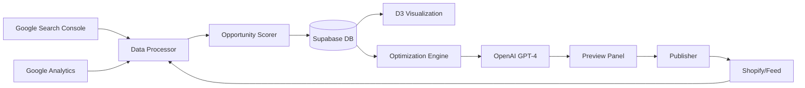

# Revenue Optimization Platform - Technical Architecture

## System Architecture Overview

### Core Philosophy

Transform ContentMax from a horizontal content generation platform to a vertical revenue optimization solution focused on e-commerce taxonomy performance.

## Architectural Decisions

### 1. Keep & Enhance (70% Reuse)

#### Visualization Layer

- **Decision**: Keep D3.js force-directed graph implementation
- **Enhancements**:
  - Add performance data overlay
  - Implement opportunity heat map
  - Real-time data binding
- **Rationale**: Core visualization is solid, just needs data integration

#### Data Infrastructure

- **Decision**: Keep Supabase as primary database
- **Enhancements**:
  - New tables for performance metrics
  - Opportunity scoring storage
  - Optimization history tracking
- **Rationale**: Supabase provides everything we need

#### Authentication & Projects

- **Decision**: Keep existing auth and project structure
- **Rationale**: No changes needed, works perfectly for new vision

### 2. Refactor & Redirect (20% Modification)

#### API Integration Layer

```typescript
// Existing structure to enhance
lib/
├── integrations/
│   ├── google-search-console.ts  // ENHANCE: Add URL-level metrics
│   ├── google-analytics.ts       // NEW: GA4 integration
│   ├── shopify.ts                // NEW: Direct publishing
│   └── openai.ts                 // REFACTOR: Category-specific prompts
```

#### Data Processing Pipeline

```typescript
// New service architecture
lib/services/
├── opportunity-scorer.ts         // NEW: Core scoring algorithm
├── benchmark-calculator.ts       // NEW: Performance benchmarks
├── revenue-simulator.ts          // NEW: What-if calculations
└── optimization-generator.ts     // REFACTOR: From generic to specific
```

### 3. Remove (10% Deprecation)

#### Features to Remove/Defer

- Generic template system
- Multi-language support
- Bulk content generation UI
- Advanced scraping features
- Complex workflow automation

## Data Flow Architecture



## Database Schema Updates

### New Tables Required

```sql
-- Performance metrics
CREATE TABLE category_performance (
    id UUID PRIMARY KEY DEFAULT gen_random_uuid(),
    project_id UUID REFERENCES projects(id) ON DELETE CASCADE,
    taxonomy_node_id UUID REFERENCES taxonomy_nodes(id),
    url TEXT NOT NULL,
    date DATE NOT NULL,
    impressions INTEGER DEFAULT 0,
    clicks INTEGER DEFAULT 0,
    ctr DECIMAL(5,4),
    position DECIMAL(4,2),
    revenue DECIMAL(10,2),
    conversion_rate DECIMAL(5,4),
    created_at TIMESTAMP DEFAULT NOW(),
    updated_at TIMESTAMP DEFAULT NOW(),
    UNIQUE(project_id, url, date)
);

-- Opportunity scores
CREATE TABLE opportunity_scores (
    id UUID PRIMARY KEY DEFAULT gen_random_uuid(),
    taxonomy_node_id UUID REFERENCES taxonomy_nodes(id),
    score DECIMAL(10,2) NOT NULL,
    components JSONB NOT NULL, -- Store score breakdown
    quick_win BOOLEAN DEFAULT FALSE,
    effort_estimate TEXT CHECK (effort_estimate IN ('low', 'medium', 'high')),
    revenue_impact DECIMAL(10,2),
    calculated_at TIMESTAMP DEFAULT NOW()
);

-- Optimization history
CREATE TABLE optimizations (
    id UUID PRIMARY KEY DEFAULT gen_random_uuid(),
    taxonomy_node_id UUID REFERENCES taxonomy_nodes(id),
    type TEXT CHECK (type IN ('meta_title', 'meta_description', 'content', 'schema')),
    original_value TEXT,
    optimized_value TEXT,
    variants JSONB, -- Store multiple variants
    applied BOOLEAN DEFAULT FALSE,
    applied_at TIMESTAMP,
    performance_before JSONB,
    performance_after JSONB,
    created_at TIMESTAMP DEFAULT NOW()
);

-- Benchmarks
CREATE TABLE performance_benchmarks (
    id UUID PRIMARY KEY DEFAULT gen_random_uuid(),
    project_id UUID REFERENCES projects(id),
    metric_type TEXT NOT NULL,
    percentile_25 DECIMAL(10,4),
    percentile_50 DECIMAL(10,4),
    percentile_75 DECIMAL(10,4),
    percentile_90 DECIMAL(10,4),
    calculated_at TIMESTAMP DEFAULT NOW()
);
```

## API Architecture

### RESTful Endpoints

```typescript
// Performance Data APIs
GET  /api/performance/categories
GET  /api/performance/category/:id
POST /api/performance/sync

// Opportunity APIs
GET  /api/opportunities
GET  /api/opportunities/:categoryId
POST /api/opportunities/calculate

// Optimization APIs
POST /api/optimize/generate
GET  /api/optimize/preview/:id
POST /api/optimize/apply/:id
GET  /api/optimize/history/:categoryId

// Simulation APIs
POST /api/simulate/revenue
GET  /api/simulate/benchmarks
```

## Service Layer Architecture

### Core Services

```typescript
// lib/services/opportunity-scorer.ts
export class OpportunityScorer {
  private readonly weights = {
    searchVolume: 0.3,
    ctrGap: 0.4,
    positionPotential: 0.2,
    competition: 0.1,
  };

  async calculateScore(
    performance: CategoryPerformance,
    benchmarks: Benchmarks
  ): Promise<OpportunityScore> {
    const components = {
      searchVolume: this.scoreSearchVolume(performance.impressions),
      ctrGap: this.scoreCTRGap(performance.ctr, benchmarks.ctr),
      positionPotential: this.scorePosition(performance.position),
      competition: this.scoreCompetition(performance),
    };

    const totalScore = Object.entries(components).reduce(
      (sum, [key, value]) => sum + value * this.weights[key],
      0
    );

    return {
      score: totalScore,
      components,
      quickWin: this.isQuickWin(components),
      revenueImpact: this.calculateRevenue(performance, benchmarks),
    };
  }
}
```

## Frontend Architecture Updates

### Component Structure

```typescript
components/
├── taxonomy/
│   ├── D3Visualization/
│   │   ├── ForceGraph.tsx       // EXISTING: Keep as-is
│   │   ├── PerformanceOverlay.tsx // NEW: Data overlay
│   │   └── OpportunityLegend.tsx  // NEW: Color legend
│   │
├── optimization/
│   ├── OptimizationPanel.tsx    // NEW: Side panel
│   ├── MetaGenerator.tsx        // NEW: Title/desc generator
│   ├── ContentGenerator.tsx     // NEW: Category content
│   └── WhatIfSimulator.tsx      // NEW: Revenue simulator
│
├── performance/
│   ├── MetricsCard.tsx          // NEW: Performance display
│   ├── TrendChart.tsx           // NEW: Historical trends
│   └── BenchmarkComparison.tsx  // NEW: Benchmark viz
```

### State Management

```typescript
// lib/stores/optimization-store.ts
interface OptimizationStore {
  // Performance data
  categoryPerformance: Map<string, CategoryPerformance>;
  opportunityScores: Map<string, OpportunityScore>;

  // UI state
  selectedCategory: string | null;
  optimizationPanel: {
    isOpen: boolean;
    mode: 'preview' | 'edit' | 'applied';
  };

  // Actions
  fetchPerformance: (projectId: string) => Promise<void>;
  calculateOpportunities: () => Promise<void>;
  generateOptimization: (categoryId: string) => Promise<void>;
  applyOptimization: (optimizationId: string) => Promise<void>;
}
```

## Integration Architecture

### Google Search Console Enhanced

```typescript
class GSCEnhancedClient {
  async getCategoryMetrics(urls: string[]): Promise<URLMetrics[]> {
    // Batch API calls
    const batches = chunk(urls, 25);

    const results = await Promise.all(batches.map((batch) => this.fetchBatch(batch)));

    return flatten(results);
  }

  private async fetchBatch(urls: string[]): Promise<URLMetrics[]> {
    // Implement rate limiting
    await this.rateLimiter.wait();

    return this.client.searchanalytics.query({
      dimensions: ['page'],
      dimensionFilterGroups: [
        {
          filters: urls.map((url) => ({
            dimension: 'page',
            operator: 'equals',
            expression: url,
          })),
        },
      ],
    });
  }
}
```

### Shopify Direct Publishing

```typescript
class ShopifyPublisher {
  async publishOptimization(optimization: Optimization, storeUrl: string): Promise<void> {
    const client = new Shopify.Clients.Rest(storeUrl, this.accessToken);

    // Update collection metafields
    await client.put({
      path: `collections/${optimization.shopifyId}`,
      data: {
        collection: {
          title: optimization.title,
          meta_description: optimization.description,
          body_html: optimization.content,
        },
      },
    });

    // Track in our database
    await this.markAsApplied(optimization.id);
  }
}
```

## Performance Considerations

### Caching Strategy

```typescript
// Use Redis for performance data caching
const cache = {
  performance: 15 * 60, // 15 minutes
  opportunities: 60 * 60, // 1 hour
  optimizations: 24 * 60 * 60, // 24 hours
};
```

### Queue Processing

```typescript
// Use Supabase Edge Functions for background jobs
const queues = {
  'sync-performance': {
    schedule: '0 2 * * *', // Daily at 2 AM
    timeout: 300, // 5 minutes
  },
  'calculate-opportunities': {
    trigger: 'on-performance-update',
    timeout: 120, // 2 minutes
  },
  'generate-optimizations': {
    trigger: 'on-demand',
    timeout: 30, // 30 seconds
  },
};
```

## Migration Strategy

### Phase 1: Data Layer (Week 1-2)

1. Create new database tables
2. Set up enhanced GSC integration
3. Build opportunity scoring service
4. Test with sample data

### Phase 2: Visualization Update (Week 3)

1. Add performance overlay to D3
2. Implement color coding
3. Add hover states
4. Test with real data

### Phase 3: Optimization Engine (Week 4-5)

1. Build AI generation service
2. Create optimization UI
3. Implement what-if simulator
4. Test end-to-end flow

### Phase 4: Publishing & Tracking (Week 6)

1. Shopify integration
2. Progress tracking
3. Analytics dashboard
4. Beta testing

## Security Considerations

### API Security

- Rate limiting on all endpoints
- OAuth for Google integrations
- API key rotation for OpenAI
- Encrypted storage for tokens

### Data Privacy

- PII isolation in separate tables
- GDPR compliance for EU customers
- Data retention policies
- Audit logging for all changes

## Monitoring & Observability

### Key Metrics

```typescript
const metrics = {
  // Performance
  apiResponseTime: 'p95 < 500ms',
  visualizationRenderTime: 'p95 < 2s',

  // Business
  opportunitiesIdentified: 'count/day',
  optimizationsGenerated: 'count/day',
  revenueImpacted: 'sum/month',

  // System
  errorRate: '< 0.1%',
  uptime: '> 99.9%',
};
```

## Technical Debt & Future Considerations

### Technical Debt to Address

1. Refactor generic content generation code
2. Remove unused template system
3. Consolidate API clients
4. Optimize database queries

### Future Enhancements

1. Real-time performance updates via webhooks
2. Machine learning for score refinement
3. Competitive intelligence integration
4. Multi-store management
5. White-label capabilities

## Decision Log

| Decision                      | Rationale                           | Alternative Considered |
| ----------------------------- | ----------------------------------- | ---------------------- |
| Keep D3.js visualization      | Already built, works well           | Rebuild with Chart.js  |
| Use Supabase for queues       | Simpler than separate queue service | Redis + BullMQ         |
| Direct Shopify integration    | Faster time to market               | Generic CMS adapter    |
| OpenAI for optimization       | Best quality, proven                | Claude, Gemini         |
| Opportunity scoring algorithm | Simple, explainable                 | ML model               |

---

This architecture enables the pivot from generic content platform to focused revenue optimization tool while maximizing code reuse and minimizing development time.
