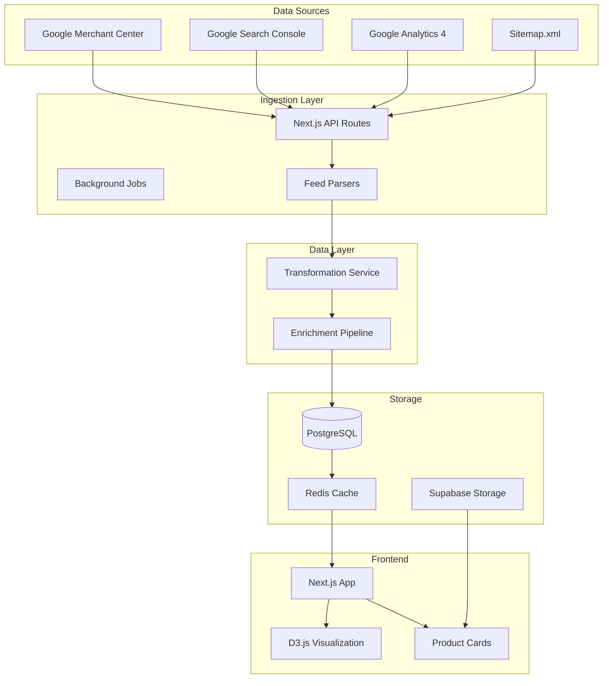
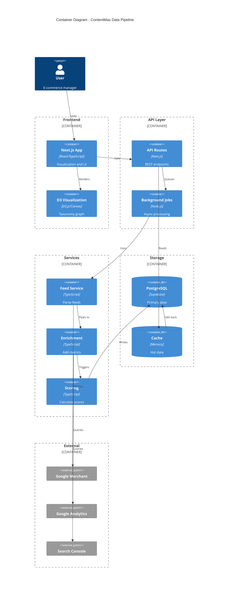
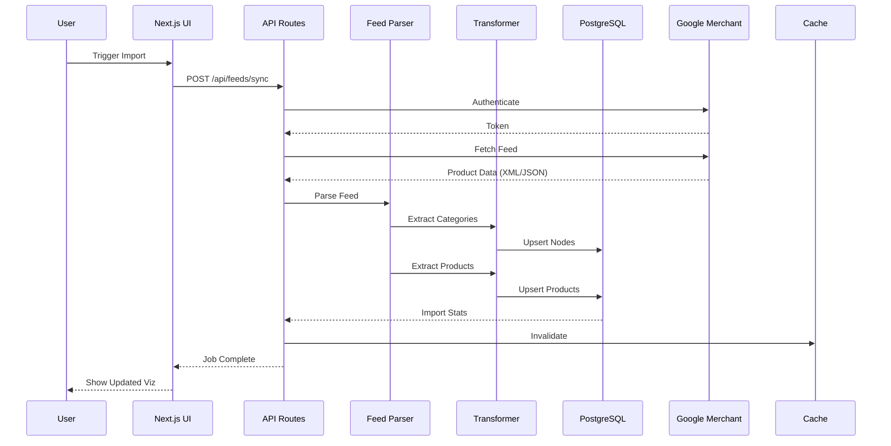
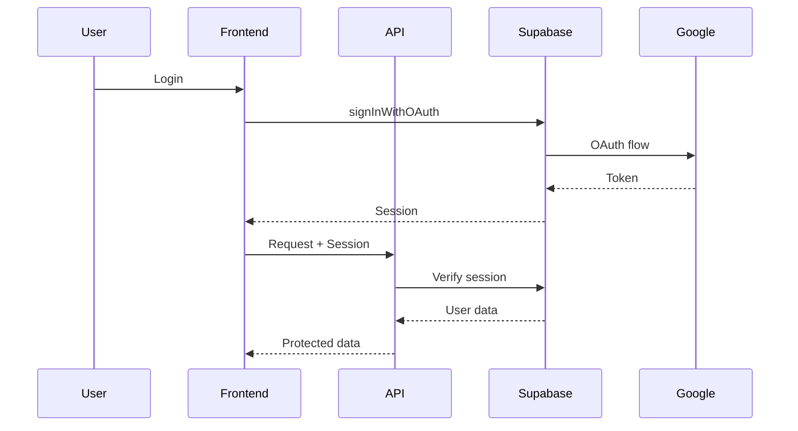
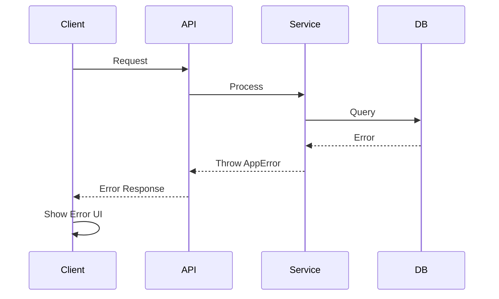

# ContentMax Data Pipeline - Fullstack Architecture Document

## Introduction

This document outlines the complete fullstack architecture for ContentMax's data ingestion and visualization pipeline, including backend systems, frontend implementation, and their integration. It serves as the single source of truth for AI-driven development, ensuring consistency across the entire technology stack.

This unified approach combines what would traditionally be separate backend and frontend architecture documents, streamlining the development process for the modern fullstack data pipeline where these concerns are increasingly intertwined.

### Starter Template or Existing Project

**Existing Project** - ContentMax is an established Next.js 15 application with:
- Supabase backend for database and auth
- D3.js taxonomy visualization already implemented
- Google integrations scaffolding in place
- Sprint 1-5 features completed

### Change Log

| Date | Version | Description | Author |
|------|---------|-------------|--------|
| 2025-01-09 | 1.0 | Initial data pipeline architecture | Winston (Architect) |
| 2025-01-09 | 1.1 | Added product data model and feed processing | Winston (Architect) |

## High Level Architecture

### Technical Summary

ContentMax employs a serverless, event-driven architecture deployed on Vercel with Supabase as the backend platform. The system uses Next.js 15 App Router for both frontend and API routes, creating a unified fullstack application. Data flows from Google Merchant feeds and other e-commerce sources through transformation pipelines into a PostgreSQL database, where it's enriched with metrics from Google Analytics and Search Console. The frontend visualizes this data through an interactive D3.js force-directed graph, displaying product hierarchies with full product details at leaf nodes. This architecture achieves the PRD goals of providing real-time taxonomy visualization with actionable insights for e-commerce optimization.

### Platform and Infrastructure Choice

**Platform:** Vercel + Supabase  
**Key Services:** 
- Vercel: Hosting, Edge Functions, Analytics
- Supabase: PostgreSQL, Auth, Real-time, Storage
- Google Cloud: Merchant Center, Search Console, Analytics APIs

**Deployment Host and Regions:** 
- Primary: us-east-1 (Vercel)
- Database: us-east-1 (Supabase)

### Repository Structure

**Structure:** Monolithic Next.js application  
**Monorepo Tool:** N/A - Single application  
**Package Organization:** Feature-based with shared libraries in /lib

### High Level Architecture Diagram



### Architectural Patterns

- **Jamstack Architecture:** Static site generation with serverless APIs - *Rationale:* Optimal performance and scalability for content-heavy e-commerce visualization
- **Event-Driven Processing:** Async job queues for data ingestion - *Rationale:* Handle large feed processing without blocking user experience
- **Repository Pattern:** Abstract data access logic - *Rationale:* Enables testing and future database migration flexibility
- **BFF Pattern:** Next.js API routes as Backend-for-Frontend - *Rationale:* Optimized data fetching for visualization needs
- **CQRS Pattern:** Separate read/write models for metrics - *Rationale:* Optimize for heavy read operations on taxonomy data
- **Incremental Static Regeneration:** ISR for product pages - *Rationale:* Balance between fresh data and performance

## Tech Stack

### Technology Stack Table

| Category | Technology | Version | Purpose | Rationale |
|----------|------------|---------|---------|-----------|
| Frontend Language | TypeScript | 5.3+ | Type-safe development | Type safety across large codebase |
| Frontend Framework | Next.js | 15.5.1 | Full-stack React framework | App Router, Server Components, API routes |
| UI Component Library | Shadcn/UI | Latest | Reusable components | Customizable, TypeScript-first |
| State Management | Zustand | 4.x | Client state management | Simple API, minimal boilerplate |
| Backend Language | TypeScript | 5.3+ | Type-safe backend | Shared types with frontend |
| Backend Framework | Next.js API Routes | 15.5.1 | Serverless functions | Unified with frontend |
| API Style | REST | - | HTTP APIs | Simple, well-understood |
| Database | PostgreSQL | 15 | Primary data store | Relational data, JSONB support |
| Cache | In-memory + Vercel | - | Response caching | Reduce database load |
| File Storage | Supabase Storage | 2.x | Product images | Integrated with auth |
| Authentication | Supabase Auth | 2.x | User management | Complete auth solution |
| Frontend Testing | Jest + RTL | 30.x | Unit/integration tests | React testing standard |
| Backend Testing | Jest | 30.x | API testing | Consistent with frontend |
| E2E Testing | Playwright | 1.40+ | End-to-end tests | Cross-browser support |
| Build Tool | Next.js | 15.5.1 | Webpack wrapper | Zero-config builds |
| Bundler | Webpack (via Next) | 5.x | Module bundling | Handled by Next.js |
| IaC Tool | N/A | - | Manual setup | Vercel auto-deploys |
| CI/CD | GitHub Actions | - | Automation | Native GitHub integration |
| Monitoring | Sentry + Vercel | Latest | Error & performance | Production observability |
| Logging | Console + Sentry | - | Debug logging | Structured logging |
| CSS Framework | Tailwind CSS | 3.4+ | Utility CSS | Rapid styling |
| Visualization | D3.js | 7.x | Data visualization | Most powerful viz library |

## Data Models

### TaxonomyNode

**Purpose:** Represents categories and products in the hierarchical structure

**Key Attributes:**
- id: UUID - Unique identifier
- url: string - Category or product URL
- title: string - Display name
- parent_id: UUID | null - Parent node reference
- depth: number - Level in hierarchy
- is_product: boolean - Leaf node indicator
- sku_count: number - Products in this category
- metrics: JSONB - Performance data

**TypeScript Interface:**
```typescript
interface TaxonomyNode {
  id: string;
  url: string;
  title: string;
  parentId: string | null;
  depth: number;
  isProduct: boolean;
  skuCount: number;
  metrics?: NodeMetrics;
  children?: TaxonomyNode[];
}
```

**Relationships:**
- Has many child nodes
- Has many products (if category)
- Has one parent (except root)
- Has many metrics records

### Product

**Purpose:** Full product data with images, pricing, and attributes

**Key Attributes:**
- id: UUID - Unique identifier
- node_id: UUID - Link to taxonomy
- google_product_id: string - External ID
- title: string - Product name
- description: text - Full description
- brand: string - Manufacturer
- price: decimal - Current price
- sale_price: decimal - Promotional price
- image_url: string - Primary image
- attributes: JSONB - Flexible attributes

**TypeScript Interface:**
```typescript
interface Product {
  id: string;
  nodeId: string;
  googleProductId: string;
  title: string;
  description: string;
  brand: string;
  price: number;
  salePrice?: number;
  currency: string;
  imageUrl: string;
  additionalImages: string[];
  availability: 'in_stock' | 'out_of_stock' | 'preorder';
  attributes: {
    gtin?: string;
    mpn?: string;
    color?: string;
    size?: string;
    material?: string;
    [key: string]: any;
  };
}
```

**Relationships:**
- Belongs to one taxonomy node
- Has many metrics records

### NodeMetrics

**Purpose:** Time-series performance data for nodes

**Key Attributes:**
- node_id: UUID - Node reference
- date: date - Metric date
- source: enum - Data source (GSC, GA4)
- impressions: integer - Search impressions
- clicks: integer - Search clicks
- revenue: decimal - Sales revenue
- conversion_rate: decimal - Purchase rate

**TypeScript Interface:**
```typescript
interface NodeMetrics {
  nodeId: string;
  date: string;
  source: 'gsc' | 'ga4' | 'shopify';
  impressions: number;
  clicks: number;
  ctr: number;
  revenue: number;
  transactions: number;
  conversionRate: number;
}
```

**Relationships:**
- Belongs to one node
- Time-series data

## API Specification

### REST API Specification

```yaml
openapi: 3.0.0
info:
  title: ContentMax Data Pipeline API
  version: 1.0.0
  description: APIs for data ingestion and retrieval
servers:
  - url: https://contentmax.vercel.app/api
    description: Production API

paths:
  /feeds/google-merchant:
    post:
      summary: Trigger Google Merchant feed sync
      requestBody:
        content:
          application/json:
            schema:
              type: object
              properties:
                merchantId: 
                  type: string
                fullSync:
                  type: boolean
      responses:
        200:
          description: Sync initiated
          content:
            application/json:
              schema:
                type: object
                properties:
                  jobId: 
                    type: string
                  status:
                    type: string

  /import/sitemap:
    post:
      summary: Import site taxonomy from sitemap
      requestBody:
        content:
          application/json:
            schema:
              type: object
              properties:
                sitemapUrl:
                  type: string
      responses:
        200:
          description: Import completed
          content:
            application/json:
              schema:
                type: object
                properties:
                  nodesCreated:
                    type: integer
                  productsFound:
                    type: integer

  /taxonomy/nodes:
    get:
      summary: Get taxonomy tree
      parameters:
        - name: depth
          in: query
          schema:
            type: integer
        - name: includeProducts
          in: query
          schema:
            type: boolean
      responses:
        200:
          description: Taxonomy tree
          content:
            application/json:
              schema:
                type: object
                properties:
                  nodes:
                    type: array
                  links:
                    type: array

  /products/{nodeId}:
    get:
      summary: Get products for a node
      parameters:
        - name: nodeId
          in: path
          required: true
          schema:
            type: string
      responses:
        200:
          description: Product list
          content:
            application/json:
              schema:
                type: array
                items:
                  $ref: '#/components/schemas/Product'
```

## Components

### Feed Ingestion Service

**Responsibility:** Parse and import data from Google Merchant feeds

**Key Interfaces:**
- `POST /api/feeds/google-merchant/sync` - Trigger sync
- `GET /api/feeds/google-merchant/status` - Check sync status

**Dependencies:** Google Merchant API, Feed Parser, Database Service

**Technology Stack:** Next.js API routes, Zod validation, Google APIs client

### Taxonomy Builder

**Responsibility:** Construct hierarchical category tree from various sources

**Key Interfaces:**
- `buildFromSitemap(url: string)` - Parse sitemap structure
- `mergeWithGoogleCategories(feed: Feed)` - Merge Google taxonomy
- `calculateDepths()` - Compute node depths

**Dependencies:** URL Parser, Database Service

**Technology Stack:** TypeScript, PostgreSQL recursive CTEs

### Product Enrichment Pipeline

**Responsibility:** Enhance product data with metrics and scores

**Key Interfaces:**
- `enrichWithMetrics(productId: string)` - Add performance data
- `calculateOpportunityScore(node: Node)` - Compute scores

**Dependencies:** Google Analytics, Search Console, Scoring Engine

**Technology Stack:** Background jobs, Promise queues

### Visualization Component

**Responsibility:** Render interactive taxonomy graph with products

**Key Interfaces:**
- `<TaxonomyVisualization data={nodes} />` - Main component
- `onNodeClick(node: Node)` - Interaction handler

**Dependencies:** D3.js, Product Card Component

**Technology Stack:** React, D3.js, Canvas rendering

### Component Diagram



## External APIs

### Google Merchant Center API

- **Purpose:** Fetch product catalog and category data
- **Documentation:** https://developers.google.com/shopping-content/v2
- **Base URL(s):** https://shoppingcontent.googleapis.com/content/v2.1
- **Authentication:** OAuth 2.0 with service account or user consent
- **Rate Limits:** 60,000 queries per day

**Key Endpoints Used:**
- `GET /content/v2.1/{merchantId}/products` - List all products
- `GET /content/v2.1/{merchantId}/products/{productId}` - Get product details

**Integration Notes:** Use batch requests for efficiency, implement exponential backoff for rate limits

### Google Search Console API

- **Purpose:** Retrieve search performance metrics
- **Documentation:** https://developers.google.com/webmaster-tools/v1
- **Base URL(s):** https://searchconsole.googleapis.com/v1
- **Authentication:** OAuth 2.0
- **Rate Limits:** 1,200 queries per minute

**Key Endpoints Used:**
- `POST /sites/{siteUrl}/searchAnalytics/query` - Get search metrics

**Integration Notes:** Maximum 1000 rows per request, data available with 2-3 day delay

### Google Analytics 4 Data API

- **Purpose:** Fetch e-commerce and behavior metrics
- **Documentation:** https://developers.google.com/analytics/devguides/reporting/data/v1
- **Base URL(s):** https://analyticsdata.googleapis.com/v1beta
- **Authentication:** OAuth 2.0 or Service Account
- **Rate Limits:** 120 requests per minute

**Key Endpoints Used:**
- `POST /properties/{propertyId}:runReport` - Get metrics report

**Integration Notes:** Use dimension filters for specific URLs, batch multiple metrics

## Core Workflows



## Database Schema

```sql
-- Core taxonomy structure
CREATE TABLE taxonomy_nodes (
  id UUID DEFAULT gen_random_uuid() PRIMARY KEY,
  parent_id UUID REFERENCES taxonomy_nodes(id),
  url VARCHAR(500) NOT NULL,
  title VARCHAR(255) NOT NULL,
  depth INTEGER DEFAULT 0,
  is_product BOOLEAN DEFAULT false,
  sku_count INTEGER DEFAULT 0,
  opportunity_score DECIMAL(6,2) DEFAULT 0,
  revenue_potential DECIMAL(12,2) DEFAULT 0,
  optimization_status VARCHAR(20) DEFAULT 'no_data',
  created_at TIMESTAMP WITH TIME ZONE DEFAULT NOW(),
  updated_at TIMESTAMP WITH TIME ZONE DEFAULT NOW(),
  
  UNIQUE(url)
);

-- Product details
CREATE TABLE products (
  id UUID DEFAULT gen_random_uuid() PRIMARY KEY,
  node_id UUID REFERENCES taxonomy_nodes(id) ON DELETE CASCADE,
  google_product_id VARCHAR(255) UNIQUE,
  title VARCHAR(500) NOT NULL,
  description TEXT,
  brand VARCHAR(255),
  image_url TEXT,
  additional_images JSONB DEFAULT '[]',
  price DECIMAL(10,2),
  sale_price DECIMAL(10,2),
  currency VARCHAR(3) DEFAULT 'USD',
  availability VARCHAR(50),
  stock_quantity INTEGER,
  attributes JSONB DEFAULT '{}',
  last_updated TIMESTAMP WITH TIME ZONE DEFAULT NOW(),
  created_at TIMESTAMP WITH TIME ZONE DEFAULT NOW()
);

-- Performance metrics
CREATE TABLE node_metrics (
  id UUID DEFAULT gen_random_uuid() PRIMARY KEY,
  node_id UUID REFERENCES taxonomy_nodes(id) ON DELETE CASCADE,
  date DATE NOT NULL,
  source VARCHAR(20) NOT NULL,
  impressions INTEGER DEFAULT 0,
  clicks INTEGER DEFAULT 0,
  ctr DECIMAL(5,4) DEFAULT 0,
  revenue DECIMAL(12,2) DEFAULT 0,
  transactions INTEGER DEFAULT 0,
  conversion_rate DECIMAL(5,4) DEFAULT 0,
  created_at TIMESTAMP WITH TIME ZONE DEFAULT NOW(),
  
  UNIQUE(node_id, date, source)
);

-- Indexes for performance
CREATE INDEX idx_taxonomy_parent ON taxonomy_nodes(parent_id);
CREATE INDEX idx_taxonomy_depth ON taxonomy_nodes(depth);
CREATE INDEX idx_products_node ON products(node_id);
CREATE INDEX idx_products_brand ON products(brand);
CREATE INDEX idx_metrics_node_date ON node_metrics(node_id, date DESC);
```

## Frontend Architecture

### Component Architecture

#### Component Organization
```
components/
├── taxonomy/
│   ├── TaxonomyVisualization.tsx    # Main container
│   ├── D3Visualization/              # D3 components
│   │   ├── ForceSimulation.ts
│   │   ├── CanvasRenderer.ts
│   │   └── InteractionHandler.ts
│   ├── ProductCard.tsx               # Product display
│   └── CategoryCard.tsx              # Category display
├── import/
│   ├── ImportWizard.tsx              # Import flow
│   ├── ProgressTracker.tsx           # Import progress
│   └── MappingEditor.tsx             # Field mapping
└── shared/
    ├── ErrorBoundary.tsx
    └── LoadingStates.tsx
```

#### Component Template
```typescript
interface TaxonomyVisualizationProps {
  data: {
    nodes: TaxonomyNode[];
    links: TaxonomyLink[];
  };
  onNodeClick?: (node: TaxonomyNode) => void;
}

export function TaxonomyVisualization({ 
  data, 
  onNodeClick 
}: TaxonomyVisualizationProps) {
  const [selectedNode, setSelectedNode] = useState<string | null>(null);
  const canvasRef = useRef<HTMLCanvasElement>(null);
  
  useEffect(() => {
    // Initialize D3 force simulation
  }, [data]);
  
  return (
    <div className="relative h-full w-full">
      <canvas ref={canvasRef} />
      {selectedNode && <NodeDetails node={selectedNode} />}
    </div>
  );
}
```

### State Management Architecture

#### State Structure
```typescript
interface AppState {
  taxonomy: {
    nodes: TaxonomyNode[];
    links: TaxonomyLink[];
    selectedNodeId: string | null;
    viewMode: 'tree' | 'graph' | 'cards';
    filters: FilterState;
  };
  products: {
    byNodeId: Record<string, Product[]>;
    loading: boolean;
  };
  import: {
    status: 'idle' | 'processing' | 'complete' | 'error';
    progress: number;
    stats: ImportStats;
  };
}
```

#### State Management Patterns
- Use Zustand for global client state
- Server state managed by TanStack Query
- Optimistic updates for user interactions
- Persist view preferences in localStorage

### Routing Architecture

#### Route Organization
```
app/
├── (dashboard)/
│   ├── dashboard/
│   │   └── page.tsx              # Main dashboard
│   ├── taxonomy/
│   │   └── page.tsx              # Taxonomy visualization
│   ├── import/
│   │   ├── page.tsx              # Import wizard
│   │   └── [source]/
│   │       └── page.tsx          # Source-specific import
│   └── products/
│       └── [nodeId]/
│           └── page.tsx          # Product list for node
└── api/
    ├── feeds/
    ├── import/
    └── metrics/
```

#### Protected Route Pattern
```typescript
export default async function TaxonomyPage() {
  const supabase = await createServerSupabaseClient();
  const { data: { user } } = await supabase.auth.getUser();
  
  if (!user) {
    redirect('/auth/login');
  }
  
  const data = await fetchTaxonomyData(user.id);
  
  return <TaxonomyVisualization data={data} />;
}
```

### Frontend Services Layer

#### API Client Setup
```typescript
class ApiClient {
  private baseUrl = '/api';
  
  async request<T>(
    endpoint: string, 
    options?: RequestInit
  ): Promise<T> {
    const response = await fetch(
      `${this.baseUrl}${endpoint}`,
      {
        ...options,
        headers: {
          'Content-Type': 'application/json',
          ...options?.headers,
        },
      }
    );
    
    if (!response.ok) {
      throw new ApiError(response);
    }
    
    return response.json();
  }
}

export const api = new ApiClient();
```

#### Service Example
```typescript
export class TaxonomyService {
  async syncGoogleMerchant(merchantId: string) {
    return api.request<SyncResponse>(
      '/feeds/google-merchant',
      {
        method: 'POST',
        body: JSON.stringify({ merchantId }),
      }
    );
  }
  
  async getTaxonomy(options?: TaxonomyOptions) {
    const params = new URLSearchParams(options);
    return api.request<TaxonomyData>(
      `/taxonomy/nodes?${params}`
    );
  }
}
```

## Backend Architecture

### Service Architecture

#### Function Organization
```
app/api/
├── feeds/
│   └── google-merchant/
│       ├── route.ts              # Main endpoint
│       ├── parser.ts             # Feed parsing
│       └── transformer.ts        # Data transformation
├── import/
│   ├── sitemap/
│   │   └── route.ts
│   └── batch/
│       └── route.ts
└── metrics/
    ├── sync/
    │   └── route.ts
    └── calculate/
        └── route.ts
```

#### Function Template
```typescript
// app/api/feeds/google-merchant/route.ts
import { NextRequest, NextResponse } from 'next/server';
import { z } from 'zod';
import { createClient } from '@/lib/supabase/server';

const RequestSchema = z.object({
  merchantId: z.string(),
  fullSync: z.boolean().optional(),
});

export async function POST(request: NextRequest) {
  try {
    // Validate input
    const body = await request.json();
    const { merchantId, fullSync } = RequestSchema.parse(body);
    
    // Check auth
    const supabase = await createClient();
    const { data: { user } } = await supabase.auth.getUser();
    if (!user) {
      return NextResponse.json(
        { error: 'Unauthorized' },
        { status: 401 }
      );
    }
    
    // Process feed
    const jobId = await enqueueFeedSync(merchantId, fullSync);
    
    return NextResponse.json({ 
      jobId, 
      status: 'processing' 
    });
  } catch (error) {
    return handleError(error);
  }
}
```

### Database Architecture

#### Schema Design
```sql
-- See Database Schema section above for complete DDL
```

#### Data Access Layer
```typescript
export class TaxonomyRepository {
  constructor(private db: SupabaseClient) {}
  
  async upsertNode(node: Partial<TaxonomyNode>) {
    const { data, error } = await this.db
      .from('taxonomy_nodes')
      .upsert(node, { 
        onConflict: 'url',
        returning: true 
      })
      .select()
      .single();
    
    if (error) throw error;
    return data;
  }
  
  async getTreeFromRoot() {
    const { data, error } = await this.db
      .rpc('get_taxonomy_tree');
    
    if (error) throw error;
    return this.buildTree(data);
  }
  
  private buildTree(flat: any[]): TaxonomyNode {
    // Build hierarchical structure
  }
}
```

### Authentication and Authorization

#### Auth Flow


#### Middleware/Guards
```typescript
export async function withAuth(
  handler: (
    req: NextRequest,
    user: User
  ) => Promise<NextResponse>
) {
  return async (req: NextRequest) => {
    const supabase = await createClient();
    const { data: { user } } = await supabase.auth.getUser();
    
    if (!user) {
      return NextResponse.json(
        { error: 'Unauthorized' },
        { status: 401 }
      );
    }
    
    return handler(req, user);
  };
}
```

## Unified Project Structure

```plaintext
contentmax/
├── .github/                      # CI/CD workflows
│   └── workflows/
│       ├── ci.yml
│       ├── preview.yml
│       └── deploy-production.yml
├── app/                          # Next.js App Router
│   ├── (auth)/                   # Auth pages
│   ├── (dashboard)/              # Dashboard pages
│   │   ├── dashboard/
│   │   ├── taxonomy/
│   │   ├── import/
│   │   └── products/
│   ├── api/                      # API routes
│   │   ├── feeds/
│   │   ├── import/
│   │   ├── metrics/
│   │   └── monitoring/
│   ├── layout.tsx
│   └── globals.css
├── components/                   # React components
│   ├── taxonomy/                 # Taxonomy components
│   ├── import/                   # Import components
│   ├── products/                 # Product components
│   ├── providers/                # Context providers
│   └── shared/                   # Shared components
├── lib/                          # Core business logic
│   ├── api/                      # API utilities
│   ├── parsers/                  # Feed parsers
│   ├── services/                 # Business services
│   ├── supabase/                 # Database clients
│   ├── security/                 # Security utilities
│   └── utils/                    # General utilities
├── hooks/                        # Custom React hooks
├── types/                        # TypeScript definitions
├── tests/                        # Test files
│   ├── unit/
│   ├── integration/
│   └── e2e/
├── supabase/                     # Database migrations
│   └── migrations/
├── public/                       # Static assets
├── docs/                         # Documentation
│   ├── architecture/
│   ├── data-pipeline/            # This document location
│   └── sprints/
├── .env.local                    # Local environment
├── package.json
├── next.config.js
├── tailwind.config.ts
└── tsconfig.json
```

## Development Workflow

### Local Development Setup

#### Prerequisites
```bash
# Required software
node --version  # 20.0.0+
npm --version   # 10.0.0+
docker --version  # For Supabase local
```

#### Initial Setup
```bash
# Clone repository
git clone https://github.com/Adstedt/contentmax.git
cd contentmax

# Install dependencies
npm install

# Start Supabase
npx supabase start

# Copy environment variables
cp .env.example .env.local
# Edit .env.local with your values

# Run migrations
npx supabase db push
```

#### Development Commands
```bash
# Start all services
npm run dev

# Start frontend only
npm run dev

# Start backend only (N/A - unified with frontend)

# Run tests
npm run test
npm run test:e2e
```

### Environment Configuration

#### Required Environment Variables
```bash
# Frontend (.env.local)
NEXT_PUBLIC_SUPABASE_URL=http://localhost:54321
NEXT_PUBLIC_SUPABASE_ANON_KEY=your-anon-key

# Backend (.env)
SUPABASE_SERVICE_ROLE_KEY=your-service-key
OPENAI_API_KEY=sk-...
GOOGLE_CLIENT_ID=...
GOOGLE_CLIENT_SECRET=...

# Shared
NODE_ENV=development
```

## Deployment Architecture

### Deployment Strategy

**Frontend Deployment:**
- **Platform:** Vercel
- **Build Command:** `npm run build`
- **Output Directory:** `.next`
- **CDN/Edge:** Vercel Edge Network

**Backend Deployment:**
- **Platform:** Vercel (Serverless Functions)
- **Build Command:** Included in frontend build
- **Deployment Method:** Automatic with frontend

### CI/CD Pipeline
```yaml
name: Deploy to Production
on:
  push:
    branches: [main]

jobs:
  test:
    runs-on: ubuntu-latest
    steps:
      - uses: actions/checkout@v4
      - uses: actions/setup-node@v4
        with:
          node-version: '20'
      - run: npm ci
      - run: npm run test
      - run: npm run type-check
      
  deploy:
    needs: test
    runs-on: ubuntu-latest
    steps:
      - uses: actions/checkout@v4
      - uses: vercel/action@v1
        with:
          vercel-token: ${{ secrets.VERCEL_TOKEN }}
          vercel-org-id: ${{ secrets.VERCEL_ORG_ID }}
          vercel-project-id: ${{ secrets.VERCEL_PROJECT_ID }}
          vercel-args: '--prod'
```

### Environments

| Environment | Frontend URL | Backend URL | Purpose |
|-------------|-------------|-------------|---------|
| Development | http://localhost:3000 | http://localhost:3000/api | Local development |
| Staging | https://contentmax-staging.vercel.app | https://contentmax-staging.vercel.app/api | Pre-production testing |
| Production | https://contentmax.vercel.app | https://contentmax.vercel.app/api | Live environment |

## Security and Performance

### Security Requirements

**Frontend Security:**
- CSP Headers: `default-src 'self'; script-src 'self' 'unsafe-inline' 'unsafe-eval';`
- XSS Prevention: React's built-in escaping, DOMPurify for user content
- Secure Storage: httpOnly cookies for auth tokens

**Backend Security:**
- Input Validation: Zod schemas on all endpoints
- Rate Limiting: 100 req/min for API, 5 req/15min for auth
- CORS Policy: Restricted to application domain

**Authentication Security:**
- Token Storage: Secure httpOnly cookies
- Session Management: Supabase managed sessions
- Password Policy: Minimum 8 chars, complexity requirements

### Performance Optimization

**Frontend Performance:**
- Bundle Size Target: <500KB initial
- Loading Strategy: Code splitting, lazy loading
- Caching Strategy: SWR for data fetching, browser caching

**Backend Performance:**
- Response Time Target: <500ms p95
- Database Optimization: Indexes on foreign keys, JSONB GIN indexes
- Caching Strategy: In-memory cache for hot data

## Testing Strategy

### Testing Pyramid
```
        E2E Tests
       /        \
   Integration Tests
    /            \
Frontend Unit  Backend Unit
```

### Test Organization

#### Frontend Tests
```
tests/
├── unit/
│   ├── components/
│   │   └── ProductCard.test.tsx
│   └── hooks/
│       └── useTaxonomy.test.ts
└── integration/
    └── TaxonomyVisualization.test.tsx
```

#### Backend Tests
```
tests/
└── api/
    ├── feeds/
    │   └── google-merchant.test.ts
    └── import/
        └── sitemap.test.ts
```

#### E2E Tests
```
tests/
└── e2e/
    ├── import-flow.spec.ts
    └── visualization.spec.ts
```

### Test Examples

#### Frontend Component Test
```typescript
describe('ProductCard', () => {
  it('displays product information', () => {
    const product = mockProduct();
    render(<ProductCard product={product} />);
    
    expect(screen.getByText(product.title)).toBeInTheDocument();
    expect(screen.getByText(product.brand)).toBeInTheDocument();
    expect(screen.getByText(`$${product.price}`)).toBeInTheDocument();
  });
});
```

#### Backend API Test
```typescript
describe('POST /api/feeds/google-merchant', () => {
  it('initiates feed sync', async () => {
    const response = await request(app)
      .post('/api/feeds/google-merchant')
      .send({ merchantId: '123456' })
      .expect(200);
    
    expect(response.body).toHaveProperty('jobId');
    expect(response.body.status).toBe('processing');
  });
});
```

#### E2E Test
```typescript
test('import and visualize flow', async ({ page }) => {
  await page.goto('/import');
  await page.fill('[name="sitemapUrl"]', 'https://example.com/sitemap.xml');
  await page.click('button[type="submit"]');
  
  await expect(page).toHaveURL('/taxonomy');
  await expect(page.locator('.taxonomy-graph')).toBeVisible();
});
```

## Coding Standards

### Critical Fullstack Rules

- **Type Sharing:** Always define types in /types and import from there
- **API Calls:** Never make direct HTTP calls - use the service layer
- **Environment Variables:** Access only through config objects, never process.env directly
- **Error Handling:** All API routes must use the standard error handler
- **State Updates:** Never mutate state directly - use proper state management patterns
- **Data Validation:** Always validate input with Zod schemas before processing

### Naming Conventions

| Element | Frontend | Backend | Example |
|---------|----------|---------|---------|
| Components | PascalCase | - | `ProductCard.tsx` |
| Hooks | camelCase with 'use' | - | `useTaxonomy.ts` |
| API Routes | - | kebab-case | `/api/google-merchant` |
| Database Tables | - | snake_case | `taxonomy_nodes` |

## Error Handling Strategy

### Error Flow


### Error Response Format
```typescript
interface ApiError {
  error: {
    code: string;
    message: string;
    details?: Record<string, any>;
    timestamp: string;
    requestId: string;
  };
}
```

### Frontend Error Handling
```typescript
export async function safeFetch<T>(
  fn: () => Promise<T>
): Promise<[T | null, Error | null]> {
  try {
    const data = await fn();
    return [data, null];
  } catch (error) {
    console.error('API Error:', error);
    toast.error('An error occurred');
    return [null, error as Error];
  }
}
```

### Backend Error Handling
```typescript
export function handleApiError(error: unknown): NextResponse {
  if (error instanceof AppError) {
    return NextResponse.json(
      { error: error.toJSON() },
      { status: error.statusCode }
    );
  }
  
  console.error('Unexpected error:', error);
  return NextResponse.json(
    { error: { message: 'Internal server error' } },
    { status: 500 }
  );
}
```

## Monitoring and Observability

### Monitoring Stack

- **Frontend Monitoring:** Vercel Analytics + Speed Insights
- **Backend Monitoring:** Vercel Functions logs
- **Error Tracking:** Sentry for client and server errors
- **Performance Monitoring:** Core Web Vitals via Vercel

### Key Metrics

**Frontend Metrics:**
- Core Web Vitals (LCP, FID, CLS)
- JavaScript errors
- API response times
- User interactions (clicks, form submissions)

**Backend Metrics:**
- Request rate
- Error rate (4xx, 5xx)
- Response time (p50, p95, p99)
- Database query performance
- External API latency

## Checklist Results Report

The architecture document is now complete. Ready to proceed with project documentation and architecture checklist execution.