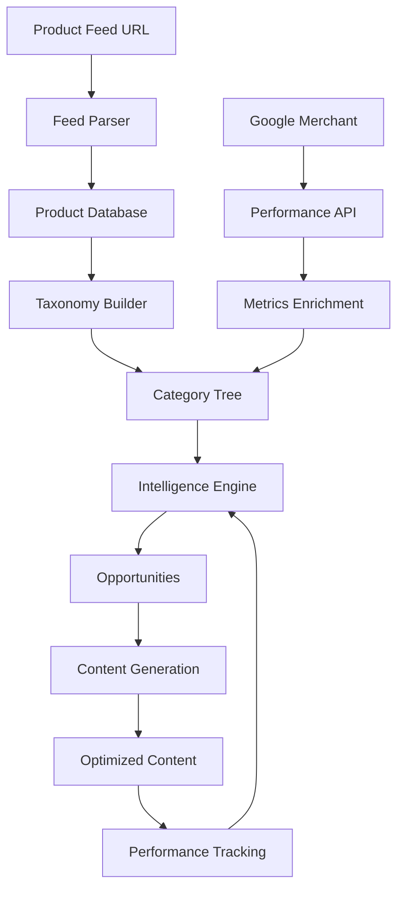

# ContentMax Data Flow Architecture

## Overview: From Feed to Insights to Action

ContentMax orchestrates a sophisticated data pipeline that transforms raw product feeds into actionable content optimization strategies. This document explains how data flows through our system and creates value at each stage.

## The Complete Data Journey



## Stage 1: Data Ingestion

### Product Feed Import

**Input Sources:**
- Google Shopping XML feeds
- Facebook Commerce feeds
- Custom XML/CSV formats
- Direct API connections

**What We Extract:**
```yaml
Product Data:
  - id: "SKU123"
  - title: "iPhone 15 Pro Max 256GB"
  - description: "Latest iPhone with..."
  - price: 1199.00
  - category: "Electronics > Phones > Smartphones"
  - brand: "Apple"
  - gtin: "1234567890123"
  - availability: "in stock"
  - image_urls: ["url1", "url2", "url3"]
  - attributes:
      color: "Natural Titanium"
      storage: "256GB"
      condition: "new"
```

**Processing Steps:**
1. **Validation**: Check feed structure and required fields
2. **Parsing**: Extract product data with error handling
3. **Normalization**: Standardize formats (prices, dates, etc.)
4. **Deduplication**: Identify and merge duplicate products
5. **Storage**: Save to PostgreSQL with indexing

## Stage 2: Taxonomy Generation

### Intelligent Category Building

**The Challenge:**
Products often have multiple category paths from different sources:
- Feed category: "Electronics/Cell Phones/Smartphones"
- Google category: "Electronics > Communications > Telephony > Mobile Phones"
- Custom category: "Phones > iPhone > Pro Models"

**Our Solution:**
```python
# Taxonomy Builder Algorithm
1. Parse all category strings into hierarchical paths
2. Identify common patterns and synonyms
3. Merge similar branches intelligently
4. Create canonical category tree
5. Map all products to canonical categories
```

**Example Transformation:**
```
Input (3 products):
- "Electronics/Phones/iPhone"
- "Electronics > Mobile Phones > Apple"  
- "Cell Phones/Smartphones/iPhone"

Output (Canonical):
Electronics
└── Mobile Phones
    └── Smartphones
        └── iPhone
            ├── Product 1
            ├── Product 2
            └── Product 3
```

## Stage 3: Performance Enhancement

### Google Merchant Center Integration

**OAuth 2.0 Flow:**
1. User authorizes ContentMax
2. We receive access & refresh tokens
3. Tokens stored encrypted in database
4. Automatic refresh before expiry

**Data Synchronization:**
```typescript
// Daily sync process
async function syncPerformanceData() {
  // 1. Fetch last 30 days of performance data
  const performanceData = await merchantAPI.getPerformance({
    startDate: '30_DAYS_AGO',
    metrics: ['impressions', 'clicks', 'conversions', 'revenue']
  });
  
  // 2. Match with products by SKU/ID
  for (const metric of performanceData) {
    const product = await findProduct(metric.offerId);
    if (product) {
      await updateProductMetrics(product.id, metric);
    }
  }
  
  // 3. Aggregate up the taxonomy tree
  await aggregateCategoryMetrics();
}
```

## Stage 4: Intelligent Aggregation

### Bottom-Up Metric Flow

**Critical Principle**: Performance metrics flow UP the tree with proper mathematical aggregation.

```
Level 3: Products (Leaf Nodes)
├── iPhone 15: 10K imp, 200 clicks, 20 orders, $20K
├── Galaxy S24: 5K imp, 75 clicks, 5 orders, $5K
└── Pixel 8: 2K imp, 30 clicks, 2 orders, $2K

Level 2: Smartphones (Sum of children)
├── Impressions: 17K (10K + 5K + 2K)
├── Clicks: 305 (200 + 75 + 30)
├── CTR: 1.79% (305/17000 × 100) ← CALCULATED!
├── Orders: 27 (20 + 5 + 2)
├── Revenue: $27K ($20K + $5K + $2K)
└── Conversion Rate: 8.85% (27/305 × 100) ← CALCULATED!

Level 1: Electronics (Sum of all descendants)
├── Impressions: 50K (all electronics products)
├── Clicks: 1000
├── CTR: 2.0% (1000/50000 × 100)
├── Orders: 100
├── Revenue: $100K
└── Conversion Rate: 10% (100/1000 × 100)
```

**Why This Matters:**
- Accurate performance representation
- Proper weighting by traffic volume
- Meaningful comparative metrics

## Stage 5: Opportunity Identification

### The Intelligence Engine

**Performance Scoring Algorithm:**
```python
def calculate_opportunity_score(category):
    score = 0
    
    # Traffic opportunity (0-30 points)
    if category.impressions > 10000:
        if category.ctr < 1:  # Well below average
            score += 30  # High opportunity
        elif category.ctr < 2:
            score += 20  # Medium opportunity
    
    # Conversion opportunity (0-30 points)
    if category.clicks > 100:
        if category.conversion_rate < 1:
            score += 30  # High opportunity
        elif category.conversion_rate < 2:
            score += 20  # Medium opportunity
    
    # Revenue potential (0-40 points)
    peer_avg_revenue = get_peer_average(category.depth)
    if category.revenue < peer_avg_revenue * 0.5:
        score += 40  # Significant underperformance
    
    return min(100, score)  # Cap at 100
```

**Insight Generation:**
```yaml
Category: Electronics > Tablets
Performance:
  - CTR: 0.8% (vs 2.1% peer average)
  - Conversion: 0.5% (vs 2.3% peer average)
  - Opportunity Score: 85/100

Insights:
  - Primary Issue: "CTR 62% below category average"
  - Root Cause: "Product titles lack key features"
  - Recommendation: "Add screen size and model year to titles"
  - Potential Impact: "+$4,500/month revenue"
  - Effort Required: "Low (bulk edit)"
  - Priority: "HIGH"
```

## Stage 6: Content Optimization

### AI-Powered Content Generation

**Input to AI Engine:**
```json
{
  "product": {
    "current_title": "Tablet Computer",
    "current_description": "Great tablet for everyday use",
    "specs": {
      "brand": "Apple",
      "model": "iPad Air",
      "screen": "10.9 inch",
      "storage": "256GB"
    }
  },
  "performance": {
    "current_ctr": 0.8,
    "target_ctr": 2.1,
    "issues": ["generic title", "missing key specs"]
  },
  "competitors": [
    {
      "title": "Apple iPad Air 10.9\" 256GB WiFi - Space Gray 2024",
      "ctr": 2.5
    }
  ]
}
```

**AI Processing:**
1. Analyze performance gaps
2. Study successful competitors
3. Apply category best practices
4. Generate optimized content
5. Ensure compliance (character limits, policies)

**Output:**
```json
{
  "optimized_title": "Apple iPad Air 10.9\" 256GB WiFi Tablet - 2024 Model - Space Gray",
  "optimized_description": "Experience the power of M1 chip in the ultra-portable iPad Air. Features 10.9-inch Liquid Retina display, all-day battery life, and compatibility with Apple Pencil and Magic Keyboard. Perfect for work, creativity, and entertainment.",
  "improvements": [
    "Added specific model details",
    "Included screen size prominently",
    "Added year for relevance",
    "Highlighted key features"
  ],
  "expected_impact": {
    "ctr_increase": "+163%",
    "revenue_increase": "+$450/month"
  }
}
```

## Stage 7: Performance Tracking

### Closed-Loop Optimization

**Continuous Monitoring:**
```typescript
// Track performance after changes
async function trackOptimizationImpact(optimizationId: string) {
  const optimization = await getOptimization(optimizationId);
  const baseline = optimization.baseline_metrics;
  const current = await getCurrentMetrics(optimization.product_id);
  
  const impact = {
    ctr_change: ((current.ctr - baseline.ctr) / baseline.ctr) * 100,
    conversion_change: ((current.cvr - baseline.cvr) / baseline.cvr) * 100,
    revenue_change: current.revenue - baseline.revenue,
    days_since_change: daysSince(optimization.applied_date),
    status: current.ctr > baseline.ctr ? 'improving' : 'needs_review'
  };
  
  await updateOptimizationTracking(optimizationId, impact);
  
  // Generate learnings for future optimizations
  if (impact.days_since_change > 14) {
    await updateMLModel(optimization, impact);
  }
}
```

## Data Storage Architecture

### PostgreSQL Schema Design

```sql
-- Core Tables
products (
  id UUID PRIMARY KEY,
  external_id VARCHAR(255),  -- SKU from feed
  google_id VARCHAR(255),     -- Google Merchant ID
  title TEXT,
  description TEXT,
  price DECIMAL(10,2),
  category_path TEXT,
  -- Performance metrics
  impressions INTEGER,
  clicks INTEGER,
  ctr DECIMAL(5,2),
  conversions INTEGER,
  conversion_rate DECIMAL(5,2),
  revenue DECIMAL(12,2),
  -- Metadata
  created_at TIMESTAMP,
  updated_at TIMESTAMP,
  last_synced_at TIMESTAMP
)

taxonomy_nodes (
  id UUID PRIMARY KEY,
  path TEXT UNIQUE,           -- "Electronics > Phones"
  title VARCHAR(255),
  depth INTEGER,
  parent_id UUID REFERENCES taxonomy_nodes(id),
  -- Aggregated metrics
  impressions INTEGER,
  clicks INTEGER,
  ctr DECIMAL(5,2),
  conversions INTEGER,
  conversion_rate DECIMAL(5,2),
  revenue DECIMAL(12,2),
  product_count INTEGER,
  performance_score INTEGER,
  -- Metadata
  created_at TIMESTAMP,
  updated_at TIMESTAMP
)

optimizations (
  id UUID PRIMARY KEY,
  product_id UUID REFERENCES products(id),
  optimization_type VARCHAR(50),  -- 'title', 'description', etc.
  original_content TEXT,
  optimized_content TEXT,
  baseline_metrics JSONB,
  current_metrics JSONB,
  impact_metrics JSONB,
  applied_at TIMESTAMP,
  created_at TIMESTAMP
)

-- Indexes for performance
CREATE INDEX idx_products_category ON products(category_path);
CREATE INDEX idx_products_performance ON products(impressions DESC, ctr);
CREATE INDEX idx_taxonomy_performance ON taxonomy_nodes(performance_score DESC);
CREATE INDEX idx_optimizations_impact ON optimizations((impact_metrics->>'revenue_change')::DECIMAL DESC);
```

## Security & Privacy

### Data Protection Measures

1. **Encryption at Rest**: All sensitive data encrypted using AES-256
2. **Encryption in Transit**: TLS 1.3 for all API communications
3. **Token Security**: OAuth tokens encrypted before storage
4. **Access Control**: Row-level security in PostgreSQL
5. **Audit Logging**: All data access logged for compliance
6. **GDPR Compliance**: Data retention and deletion policies

### API Rate Limiting

```typescript
// Protect against abuse
const rateLimits = {
  'google_merchant_api': {
    requests_per_minute: 60,
    requests_per_day: 10000
  },
  'content_generation': {
    requests_per_minute: 10,
    requests_per_hour: 100
  },
  'data_export': {
    requests_per_day: 50
  }
};
```

## Scalability Considerations

### Performance Optimization

1. **Database Partitioning**: Partition large tables by date/user
2. **Caching Strategy**: Redis for frequently accessed data
3. **Async Processing**: Background jobs for heavy operations
4. **CDN Integration**: CloudFront for static assets
5. **Query Optimization**: Materialized views for complex aggregations

### Load Handling

```yaml
Current Capacity:
  - Products per account: 1,000,000+
  - Categories per taxonomy: 10,000+
  - API requests/second: 100
  - Concurrent users: 1,000+

Scaling Strategy:
  - Horizontal scaling for API servers
  - Read replicas for database
  - Queue-based processing for bulk operations
  - Microservices for specialized tasks
```

## Monitoring & Observability

### Key Metrics Tracked

```typescript
// System Health
- API response times (p50, p95, p99)
- Database query performance
- Queue processing times
- Error rates by endpoint

// Business Metrics
- Products imported/day
- Optimizations generated/day
- Average CTR improvement
- Revenue impact tracked

// User Engagement
- Daily active users
- Features used per session
- Time to first optimization
- Retention rates
```

## Conclusion

ContentMax's data architecture transforms scattered product information into a coherent, actionable intelligence system. By combining proper mathematical aggregation with AI-powered insights, we help merchants focus on the optimizations that actually drive revenue.

The key differentiator: We don't just show you data - we show you exactly what to do with it.

---

*Last Updated: January 2025*
*Version: 1.0*
*Classification: Public*