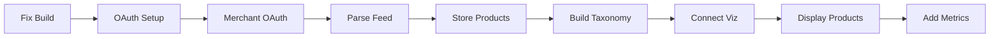

# Sprint 6 Overview: Google Merchant Data Integration

## Sprint Goals
Transform ContentMax from demo visualization to production system by implementing Google Merchant product feed integration as the primary data source.

## Sprint Duration
**5 Days** (40 hours estimated)

## Sprint Backlog

### 11 Stories (Total: 33 Story Points)

| Story ID | Title | Priority | Points | Hours |
|----------|-------|----------|---------|-------|
| STORY-001 | Fix Build Blockers and TypeScript Errors | P0 | 2 | 2h |
| STORY-002 | Configure Google OAuth Credentials | P0 | 2 | 2h |
| STORY-006 | Implement Google Merchant OAuth Flow | P0 | 3 | 3h |
| STORY-007 | Parse Google Product Feed | P0 | 5 | 4h |
| STORY-008 | Store Products with Full Attributes | P0 | 3 | 3h |
| STORY-004 | Build Taxonomy from Product Feed | P0 | 3 | 3h |
| STORY-005 | Connect Visualization to Database | P0 | 2 | 2h |
| STORY-009 | Display Product Cards with Real Data | P0 | 3 | 3h |
| STORY-010 | Integrate Google Search Console Metrics | P1 | 3 | 3h |
| STORY-011 | Integrate Google Analytics 4 Data | P1 | 3 | 3h |
| STORY-012 | Calculate Opportunity Scores | P1 | 5 | 4h |

## Daily Plan

### Day 1: Foundation (4 hours)
- ✅ STORY-001: Fix build blockers
- ✅ STORY-002: Configure OAuth credentials

### Day 2: Google Merchant Pipeline Setup (7 hours)
- ✅ STORY-006: OAuth flow implementation
- ✅ STORY-007: Product feed parser

### Day 3: Data Storage & Taxonomy (9 hours)
- ✅ STORY-008: Store products with attributes
- ✅ STORY-004: Build taxonomy from feed
- ✅ STORY-005: Connect visualization

### Day 4: UI & Display (3 hours)
- ✅ STORY-009: Display product cards

### Day 5: Metrics Integration (10 hours)
- ✅ STORY-010: Search Console integration
- ✅ STORY-011: GA4 integration
- ✅ STORY-012: Opportunity scoring

## Critical Path

## Success Metrics

### Must Have (Sprint Commitment)
- ✅ Build succeeds without errors
- ✅ Google OAuth working
- ✅ Product feed imports successfully
- ✅ Taxonomy displays real categories
- ✅ Product cards show real data

### Should Have
- ✅ Search Console metrics integrated
- ✅ GA4 metrics integrated
- ✅ Opportunity scores calculated

### Nice to Have (if time permits)
- Performance optimization
- Additional error handling
- Enhanced UI polish

## Technical Focus Areas

1. **Google Merchant Integration** (Primary)
   - OAuth2 flow
   - Product feed parsing
   - Category extraction from product_type field

2. **Data Architecture**
   - JSONB for flexible product attributes
   - Efficient batch processing
   - Proper indexing for performance

3. **Visualization Updates**
   - Remove hardcoded demo data
   - Connect to real database
   - Product card enhancements

## Risks & Mitigations

| Risk | Impact | Mitigation |
|------|--------|------------|
| Google API complexity | High | Detailed documentation, error handling |
| Large feed processing | Medium | Batch processing, pagination |
| OAuth issues | High | Clear setup guide, debugging tools |
| Performance with real data | Medium | Indexing, caching, lazy loading |

## Dependencies

### External
- Google Cloud Console access
- Google Merchant Center account with products
- Google Search Console access
- Google Analytics 4 property

### Internal
- Database schema ready
- Supabase configured
- D3 visualization component working

## Definition of Done for Sprint

- [ ] All P0 stories completed
- [ ] Google Merchant integration fully functional
- [ ] Real products displaying in visualization
- [ ] No critical bugs
- [ ] Documentation updated
- [ ] Ready for Sprint 7 (production readiness)

## Notes for Development Team

1. **Focus on Google Merchant first** - This is our primary data source
2. **Test with real merchant accounts early** - Don't wait until the end
3. **Product feed categories are source of truth** - Not URLs
4. **Keep sitemap parser for Sprint 7** - It's a fallback, not primary

## Handoff to Sprint 7

Sprint 7 will focus on:
- Production readiness
- Fallback options (sitemap)
- Error recovery
- Integration testing
- Deployment validation

---
**Sprint Start:** TBD  
**Sprint End:** TBD  
**Sprint Velocity Target:** 33 points  
**Team Capacity:** 40 hours