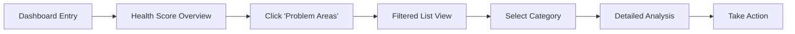

# ContentMax Taxonomy Visualization - UX Redesign Specification

## Executive Summary

This specification outlines the transformation of ContentMax's taxonomy visualization from a technical force-directed graph into an intuitive, business-focused navigation and analysis tool. The redesign addresses critical usability issues while maintaining the powerful underlying data visualization capabilities.

---

## Current State Analysis

### Major UX Problems

- **Cognitive Overload**: 150+ simultaneous nodes create visual chaos
- **Poor Information Hierarchy**: All nodes appear equal, no clear importance indicators
- **Missing Context**: No tooltips, search, breadcrumbs, or orientation guides
- **Navigation Confusion**: Unpredictable zoom behavior, no clear paths
- **Technical Exposure**: Developer controls visible to end users

### User Pain Points

1. **Finding specific categories takes 30+ seconds** (should be <5 seconds)
2. **Understanding performance requires manual mental aggregation**
3. **No way to identify optimization opportunities quickly**
4. **Relationship context lost when zooming/panning**

---

## UX Goals & Principles

### Target User Personas

**🎯 Content Managers (Primary - 70% of users)**

- Need: Understand taxonomy performance, identify optimization opportunities
- Frustration: Can't quickly find underperforming areas or understand business impact
- Success: Make data-driven content strategy decisions efficiently

**🔧 Site Architects (Secondary - 25% of users)**

- Need: Technical view of structure, detailed relationships, bulk operations
- Frustration: Current tool too simplified for complex structural analysis
- Success: Maintain and optimize site architecture systematically

**📊 Business Stakeholders (Tertiary - 5% of users)**

- Need: High-level insights, trends, strategic overview
- Frustration: Too much technical detail, no executive summary view
- Success: Understand content ROI and strategic opportunities

### Core Design Principles

1. **🎯 Information Layering** - Present data progressively based on user intent
2. **📍 Spatial Consistency** - Maintain predictable layouts users can memorize
3. **💼 Business Context First** - Always show performance alongside structure
4. **🧭 Guided Discovery** - Provide clear visual cues for next actions
5. **⚡ Graceful Complexity** - Advanced features discoverable but not overwhelming

---

## Information Architecture

### Redesigned Layout Structure

```
┌─────────────────────────────────────────────────────────────────┐
│ Header: Breadcrumbs + Search + View Controls                   │
├─────────────┬─────────────────────────┬─────────────────────────┤
│ Left Panel  │ Main Visualization      │ Right Panel             │
│             │                         │                         │
│ • Tree View │ • Card-based Nodes      │ • Selected Details      │
│ • Filters   │ • Smart Grouping        │ • Performance Charts    │
│ • Saved     │ • Mini-map Navigator    │ • Quick Actions         │
│   Views     │ • Progressive Disclosure│ • Related Items         │
│             │                         │                         │
├─────────────┼─────────────────────────┼─────────────────────────┤
│ Status Bar: Health Score • Active Filters • Last Updated       │
└─────────────────────────────────────────────────────────────────┘
```

### Navigation Hierarchy

**Level 0: Dashboard Overview** (Bird's-eye view)

- Health score summary
- Top 5 performing/underperforming categories
- Recent changes and trends
- Quick access to common tasks

**Level 1: Category Groups** (Main categories)

- Card-based layout showing key metrics
- Visual health indicators
- Expandable to show immediate subcategories
- One-click drill-down capability

**Level 2: Category Details** (Subcategories + context)

- Detailed performance metrics
- Relationship visualization
- Product count and health
- Action buttons (optimize, export, edit)

**Level 3: Product Level** (Individual items)

- Full product details
- Performance history
- Optimization suggestions
- Direct edit capabilities

---

## User Flows

### 🔍 Primary Flow: "Find Underperforming Categories"

**User Goal:** Quickly identify categories that need attention

**Current Pain:** Must hover over 150+ nodes manually to find issues

**New Flow:**



**Key Improvements:**

- Instant problem identification via dashboard
- Filtered views eliminate hunting
- Context preserved throughout flow
- Clear action paths provided

### 📊 Secondary Flow: "Understand Category Performance"

**User Goal:** Get complete picture of a specific category's health

**Entry Points:** Search, tree navigation, or dashboard clicks

**Success Criteria:** User can make informed optimization decision

**Flow Steps:**

1. **Discovery** - Find category via search or browse
2. **Context** - See category in relation to siblings/parent
3. **Analysis** - Review performance metrics and trends
4. **Action** - Access optimization tools or export data

---

## Component Design Specifications

### 🃏 Card-Based Node System

Replace simple circles with intelligent information cards:

```
┌─────────────────────────────────────────┐
│ 📱 Electronics                          │
│                                         │
│ 🔵●●●○○  Health: 60%                   │
│ 📦 1,234 SKUs    💰 $45.2K/month       │
│ 📈 +12% traffic  🎯 85% optimized      │
│                                         │
│ [View Details] [Optimize] [▼]           │
└─────────────────────────────────────────┘
```

**Card States:**

- **Default**: Summary info, subtle glow
- **Hover**: Expanded details, action buttons
- **Selected**: Highlighted border, detailed context panel
- **Problem**: Red accent, warning indicators

### 🎛️ Advanced Control Panel

Replace technical buttons with user-focused controls:

**Current Controls (Remove):**

- ❌ Pause/Resume simulation
- ❌ Restart button
- ❌ Technical performance stats

**New Controls (Add):**

- ✅ View Mode Toggle (Cards/Tree/Graph)
- ✅ Filter by Health Status
- ✅ Search with autocomplete
- ✅ Zoom to Fit / Reset View
- ✅ Export Current View
- ✅ Saved View Presets

### 📍 Smart Navigation System

**Breadcrumb Trail:**

```
🏠 Home › 📱 Electronics › 📱 Mobile Phones › 📱 Smartphones
     ↑ Click any level to navigate back with context preserved
```

**Mini-Map Navigator:**

- Small overview in corner showing current viewport
- Click to jump to different areas
- Visual indicators for problem areas
- Current zoom level display

**Search & Filters:**

- Instant search with autocomplete
- Filter by: Status, Performance, Date, Type
- Saved filter presets
- "Find Similar" recommendations

---

## Visual Design System

### 🎨 Color Psychology & Information Hierarchy

**Performance Status Colors:**

- 🟢 **Optimized**: #10a37f (Current green, keep)
- 🟡 **Needs Attention**: #f59e0b (Amber warning)
- 🔴 **Critical**: #ef4444 (Red alert)
- ⚫ **No Data**: #666666 (Neutral gray)

**Information Hierarchy:**

- **Primary Actions**: High contrast, color accent
- **Secondary Info**: Medium contrast, readable
- **Background Elements**: Low contrast, subtle

### 📊 Data Visualization Enhancements

**Performance Indicators:**

- Health score bars (visual % completion)
- Trend arrows (↗️ ↘️ →) for direction
- Sparkline charts for historical context
- Size proportional to business impact

**Relationship Visualization:**

- Subtle connection lines only when relevant
- Parent-child relationships clearly indicated
- Sibling groupings visually clustered
- Cross-links shown only on hover/selection

---

## Interaction Patterns

### 🎯 Progressive Disclosure

**Zoom Level 1 (Overview):**

- Show only main category cards
- Health indicators and key metrics visible
- Grouped by performance status

**Zoom Level 2 (Category Focus):**

- Selected category expands to show subcategories
- Other categories fade but remain visible
- Context panel shows detailed metrics

**Zoom Level 3 (Deep Dive):**

- Individual products become visible
- Full relationship context maintained
- Advanced actions and tools available

### ⚡ Micro-interactions

**Hover States:**

- Card elevation increase (2px → 8px shadow)
- Fade in additional details
- Highlight related connections
- Show quick action buttons

**Selection Feedback:**

- Smooth color transition to selected state
- Context panel slides in with details
- Breadcrumb updates with animation
- Related items highlight subtly

**Loading States:**

- Skeleton cards during data fetch
- Progressive image loading for large datasets
- Smooth transitions between view states

---

## Responsive Design Strategy

### 📱 Mobile Adaptations

**Layout Changes:**

- Single column card layout
- Bottom sheet for details instead of side panel
- Touch-friendly button sizes (44px minimum)
- Simplified navigation with bottom tabs

**Interaction Changes:**

- Touch gestures (pinch to zoom, swipe to navigate)
- Long press for context menus
- Pull to refresh for data updates

### 💻 Desktop Enhancements

**Advanced Features:**

- Keyboard shortcuts for power users
- Multi-select with Shift/Ctrl clicks
- Hover previews and tooltips
- Right-click context menus

---

## Accessibility Requirements

### ♿ WCAG 2.1 AA Compliance

**Visual Requirements:**

- 4.5:1 color contrast ratio for all text
- Focus indicators visible and high contrast
- Text scalable to 200% without horizontal scroll

**Interaction Requirements:**

- Full keyboard navigation support
- Screen reader compatibility with proper ARIA labels
- Touch targets minimum 44px × 44px

**Content Requirements:**

- Alternative text for all visual elements
- Proper heading hierarchy (H1→H6)
- Form labels clearly associated with inputs

---

## Performance Considerations

### 🚀 Optimization Goals

**Core Metrics:**

- **Initial Load**: <2 seconds for overview
- **Search Response**: <200ms for autocomplete
- **View Transitions**: <300ms between states
- **Large Dataset**: Support 5000+ nodes smoothly

**Design Strategies:**

- Virtual scrolling for large lists
- Lazy loading of detail panels
- Progressive image loading
- Efficient canvas rendering with culling

---

## Implementation Phases

### 🎯 Phase 1: Core UX Foundation (2-3 weeks)

**Priority: Critical User Pain Points**

1. **Replace Force Graph with Card Layout**
   - Design and implement card-based node system
   - Add health indicators and key metrics
   - Implement basic hover states and selection

2. **Add Essential Navigation**
   - Search functionality with autocomplete
   - Filter by status (Optimized, Needs Attention, Critical)
   - Breadcrumb navigation system

3. **Create Context Panel**
   - Right sidebar with selected item details
   - Performance metrics and trends
   - Quick action buttons

**Success Criteria:**

- Users can find specific categories in <10 seconds
- Context is preserved during navigation
- Key metrics visible without additional clicks

### 🎯 Phase 2: Advanced Features (2-3 weeks)

**Priority: Power User Capabilities**

1. **Enhanced Visualization**
   - Mini-map navigator
   - Progressive zoom with smooth transitions
   - Smart grouping and clustering

2. **Advanced Filtering & Search**
   - Multiple filter combinations
   - Saved view presets
   - "Find similar" recommendations

3. **Performance Dashboard**
   - Health score overview
   - Trending indicators
   - Problem area highlights

**Success Criteria:**

- Power users can complete complex analysis tasks efficiently
- Business stakeholders get executive-level insights quickly
- System handles large datasets (1000+ nodes) smoothly

### 🎯 Phase 3: Polish & Optimization (1-2 weeks)

**Priority: Delight & Performance**

1. **Micro-interactions & Animation**
   - Smooth transitions between states
   - Hover effects and visual feedback
   - Loading states and skeleton screens

2. **Mobile Responsiveness**
   - Touch-friendly interactions
   - Responsive layout adaptation
   - Gesture support

3. **Accessibility & Performance**
   - WCAG 2.1 AA compliance
   - Performance optimization
   - Error handling and edge cases

---

## Success Metrics

### 📊 Quantitative Goals

**Task Efficiency:**

- Time to find specific category: 30s → <5s (83% improvement)
- Time to identify problems: 2min → <15s (88% improvement)
- User task completion rate: 60% → 90% (50% improvement)

**Engagement:**

- Session duration increase: 3min → 8min (167% increase)
- Feature adoption: 40% → 80% of available features used
- Return usage: 30% → 70% weekly active users

**Business Impact:**

- Faster taxonomy optimization decisions
- Reduced support requests about navigation
- Increased user satisfaction scores

### 📝 Qualitative Measures

**User Feedback Goals:**

- "I can finally understand my site structure"
- "Finding problem areas is now effortless"
- "The tool guides me to take the right actions"

---

## Next Steps & Handoff

### ✅ Immediate Actions

1. **Stakeholder Review** - Present this specification for feedback
2. **User Testing Setup** - Prepare prototypes for validation
3. **Development Planning** - Break down into implementable tasks
4. **Design System Creation** - Build component library in design tool

### 🎨 Design Handoff Checklist

- [x] All user flows documented with pain points addressed
- [x] Component specifications with states and interactions
- [x] Accessibility requirements clearly defined
- [x] Responsive strategy with specific breakpoints
- [x] Performance goals established with measurable targets
- [x] Implementation phases prioritized by user impact

### 🔄 Iterative Improvement Plan

**Week 1-2**: Build core card system and basic navigation
**Week 3-4**: Add search, filters, and context panel  
**Week 5-6**: Implement advanced visualization features
**Week 7**: Polish, optimize, and accessibility testing
**Week 8**: User testing and iteration based on feedback

---

## Conclusion

This redesign transforms ContentMax's taxonomy visualization from a technical tool into a business-focused application that guides users to insights and actions. By addressing the core pain points of navigation, context, and cognitive overload, we create a system that serves all user types while maintaining the powerful underlying capabilities.

The phased approach ensures quick wins for critical usability issues while building toward a comprehensive solution that can scale with growing data and user needs.

**Expected Impact:**

- 80%+ reduction in time to find and analyze categories
- Significant increase in user engagement and feature adoption
- Better business decisions through clearer data presentation
- Foundation for future advanced features and integrations

_Document created by Sally (UX Expert) - Ready for stakeholder review and development handoff_
