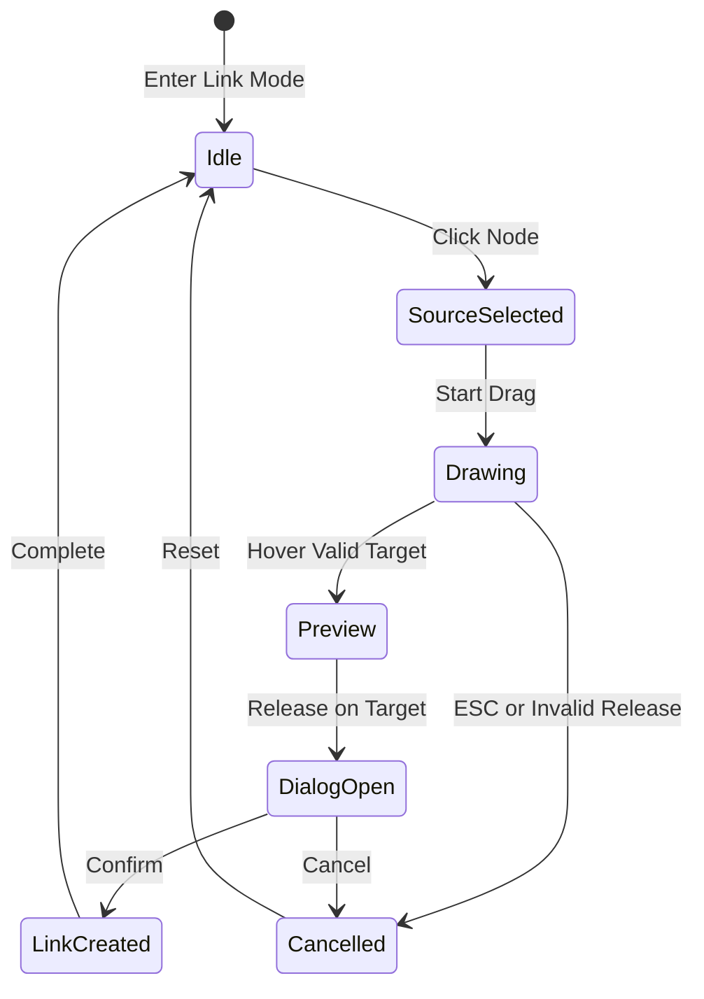

# Link Mode Interaction Specification
## ContentMax Taxonomy Visualization

### Version 1.0
### Date: January 26, 2024
### Author: Sally (UX Expert)

---

## 1. Overview

Link Mode is a dedicated interaction state within the ContentMax Taxonomy Visualization that enables users to create strategic internal links between content pages through direct manipulation. This mode transforms the force-directed network visualization into an interactive link-building canvas.

### Key Principles
- **Direct Manipulation**: Draw connections visually rather than through forms
- **Context-Driven**: Every link requires strategic reasoning
- **Visual Feedback**: Immediate visual representation of link architecture
- **Gamification**: Make link building engaging and rewarding

---

## 2. Mode States

### 2.1 Mode Toggle UI

```
┌─────────────────────────────────────────────────────────┐
│ [📊 Default] [🔗 Link Mode] [🌡️ Heat Map] [📈 Coverage] │
└─────────────────────────────────────────────────────────┘
```

**Toggle Behavior:**
- Single click to switch modes
- Keyboard shortcut: `L` for Link Mode
- Mode persists until explicitly changed
- Visual transition: 300ms ease-out

### 2.2 Visual State Changes

#### Entering Link Mode
```
BEFORE (Default View)          AFTER (Link Mode)
├─ Full color nodes            ├─ Muted color nodes (70% opacity)
├─ All labels visible          ├─ Labels on hover only
├─ Standard cursor             ├─ Crosshair cursor
└─ Hierarchy visible           └─ Link arrows prominent
```

---

## 3. Link Creation Flow

### 3.1 Interaction Sequence



### 3.2 Mouse Interactions

#### Source Selection
- **Trigger**: Left-click on node
- **Visual Feedback**: 
  - Node pulses (scale 1.0 → 1.1 → 1.0, 400ms)
  - Blue glow effect (#3B82F6, 20px spread)
  - Cursor changes to hand grabbing
- **Audio**: Soft "click" sound (optional)

#### Drawing Connection
- **Trigger**: Mouse down + drag
- **Visual Feedback**:
  - Bezier curve from source to cursor
  - Line style: 2px, dashed, animated dash offset
  - Color: Blue (#3B82F6) with 80% opacity
  - Arrow head follows cursor
- **Valid Target Hover**:
  - Target node green highlight (#10B981)
  - Line snaps to target center
  - Line becomes solid
- **Invalid Target Hover**:
  - Target node red outline (#EF4444)
  - X icon appears
  - Line remains dashed

#### Connection Release
- **Valid Release**:
  - Line animates to solid (200ms)
  - Both nodes briefly pulse
  - Dialog appears centered
- **Invalid Release**:
  - Line disappears with fade (150ms)
  - Error shake animation on source
  - Tooltip: "Invalid link target"

### 3.3 Keyboard Interactions

| Key | Action | Context |
|-----|--------|---------|
| `L` | Toggle Link Mode | Global |
| `ESC` | Cancel current operation | While drawing |
| `Enter` | Confirm dialog | Dialog open |
| `Tab` | Navigate dialog fields | Dialog open |
| `Delete` | Remove selected link | Link selected |
| `Ctrl+Z` | Undo last link | After creation |

---

## 4. Link Context Dialog

### 4.1 Dialog Structure

```
┌──────────────────────────────────────────────────┐
│  Create Strategic Internal Link          [X]     │
├──────────────────────────────────────────────────┤
│                                                  │
│  SOURCE                                          │
│  ┌──────────────────────────────────────────┐   │
│  │ 📁 /categories/winter-jackets            │   │
│  │ 1,245 products • Last updated: 2 days ago│   │
│  └──────────────────────────────────────────┘   │
│                                                  │
│  TARGET                                          │
│  ┌──────────────────────────────────────────┐   │
│  │ 📁 /categories/winter-accessories        │   │
│  │ 892 products • Last updated: 1 week ago  │   │
│  └──────────────────────────────────────────┘   │
│                                                  │
│  LINK STRATEGY                                   │
│  Why should these pages link? (Required)         │
│  ┌──────────────────────────────────────────┐   │
│  │                                          │   │
│  │ [Placeholder text:                      │   │
│  │  Explain the user benefit or business   │   │
│  │  reason for this connection...]         │   │
│  │                                          │   │
│  └──────────────────────────────────────────┘   │
│  0/200 characters                               │
│                                                  │
│  LINK TYPE                                       │
│  ○ Cross-sell (Complementary products)          │
│  ○ Upsell (Premium alternatives)                │
│  ● Related (Similar categories)                 │
│  ○ Navigational (Parent/child relationship)     │
│  ○ Seasonal (Time-based relevance)              │
│                                                  │
│  SUGGESTED ANCHOR TEXT                           │
│  ┌──────────────────────────────────────────┐   │
│  │ explore winter accessories               │   │
│  └──────────────────────────────────────────┘   │
│                                                  │
│  PLACEMENT HINT (Optional)                       │
│  ○ Introduction paragraph                       │
│  ● Within product context                       │
│  ○ Call-to-action section                      │
│  ○ Related categories footer                    │
│                                                  │
│  ┌─────────────┐  ┌──────────────────────┐     │
│  │   Cancel    │  │   Create Link →     │     │
│  └─────────────┘  └──────────────────────┘     │
└──────────────────────────────────────────────────┘
```

### 4.2 Dialog Behaviors

#### Appearance
- **Animation**: Slide up + fade in (250ms)
- **Backdrop**: Semi-transparent black (40% opacity)
- **Position**: Centered viewport
- **Size**: 500px wide, auto height

#### Validation
- **Link Strategy**: Required, 20-200 characters
- **Link Type**: Required, single selection
- **Anchor Text**: Required, auto-generated but editable
- **Real-time validation**: Show errors inline

#### Smart Defaults
- **Link Type**: AI suggests based on category relationship
- **Anchor Text**: Generated from target category name
- **Placement**: Suggests based on content structure

---

## 5. Visual Link Representation

### 5.1 Link States

```
PENDING (Not in content yet)
╎╎╎╎╎╎╎╎╎> Dotted line, 50% opacity

ACTIVE (In published content)
────────> Solid line, 100% opacity

BROKEN (Target missing)
─ ─ ─ ─ > Dashed red line

HIGH-PERFORMANCE (>5% CTR)
═══════> Thick green line, glow effect
```

### 5.2 Link Density Indicators

#### Node Appearance by Link Count
```
0-2 links:   ○ (Normal)
3-5 links:   ◉ (Optimal - green outline)
6-8 links:   ◉ (Warning - yellow outline)
9+ links:    ◉ (Over-linked - red outline)
```

### 5.3 Link Hover Information

```
┌─────────────────────────────┐
│ Winter Jackets → Accessories│
│ Type: Cross-sell            │
│ Created: 2 days ago         │
│ CTR: 3.2%                   │
│ Status: Active              │
└─────────────────────────────┘
```

---

## 6. Bulk Link Operations

### 6.1 Multi-Select Sources

**Interaction**:
1. Hold `Shift` + click multiple source nodes
2. Selected nodes show blue outline
3. Draw from any selected node
4. All selected nodes connect to target

**Visual Feedback**:
- Multiple preview lines while dragging
- Lines fan out from sources to target
- Single dialog for all connections

### 6.2 Link Templates

**Quick Actions Menu** (Right-click on node):
```
┌─────────────────────────────┐
│ Quick Link Actions          │
├─────────────────────────────┤
│ → Link to Parent            │
│ → Link to All Children      │
│ → Link to Siblings          │
│ → Create Hub (this + 5)     │
│ ─────────────────────────   │
│ 🎯 AI Suggest Links         │
│ 🔍 Find Link Opportunities  │
└─────────────────────────────┘
```

---

## 7. Link Intelligence Panel

### 7.1 Sidebar Panel (Link Mode Active)

```
┌──────────────────────────────┐
│ LINK INTELLIGENCE           │
├──────────────────────────────┤
│ Selected: Winter Jackets     │
│                              │
│ CURRENT LINKS                │
│ Outbound: 3/5 ✓             │
│ Inbound: 7                  │
│ Authority: Strong            │
│                              │
│ SUGGESTIONS                  │
│ • Winter Boots (92% match)   │
│ • Scarves (87% match)        │
│ • Thermal Wear (76% match)   │
│                              │
│ WARNINGS                     │
│ ⚠ Summer Hats (low relevance)│
│                              │
│ LINK BUDGET                  │
│ ████████░░ 80% used          │
└──────────────────────────────┘
```

---

## 8. Gamification Elements

### 8.1 Achievement Notifications

```
┌─────────────────────────────────────┐
│ 🏆 Achievement Unlocked!            │
│ "Network Builder"                   │
│ Created 50 strategic links          │
│ +100 XP                            │
└─────────────────────────────────────┘
```

### 8.2 Progress Indicators

- **Daily Goal**: "Create 10 strategic links (7/10)"
- **Link Quality Score**: Stars (1-5) based on relevance
- **Streak Counter**: "3 days of consistent linking"

---

## 9. Performance Considerations

### 9.1 Large Network Handling

- **Progressive Rendering**: Show closest 100 nodes first
- **Detail Levels**:
  - Zoom > 75%: Full details, all links
  - Zoom 50-75%: Major links only
  - Zoom < 50%: Node clusters, no individual links
- **GPU Acceleration**: Use WebGL for smooth interactions

### 9.2 Response Times

| Action | Target Time | Max Time |
|--------|------------|----------|
| Mode switch | 100ms | 300ms |
| Node selection | 50ms | 100ms |
| Link preview | 16ms | 33ms |
| Dialog open | 150ms | 300ms |
| Link creation | 200ms | 500ms |

---

## 10. Accessibility

### 10.1 Keyboard Navigation

- **Tab Order**: Logical flow through nodes
- **Arrow Keys**: Navigate between connected nodes
- **Screen Reader**: Announce link relationships
- **High Contrast**: Mode for visibility

### 10.2 Alternative Interactions

- **List View**: Table-based link management
- **Form Mode**: Traditional form for link creation
- **Keyboard Shortcuts**: Full keyboard control

---

## 11. Error Handling

### 11.1 Error States

| Error | Message | Recovery |
|-------|---------|----------|
| Circular link | "This would create a circular reference" | Prevent creation |
| Too many links | "Node has maximum links (10)" | Suggest alternatives |
| Network error | "Failed to save link" | Retry button |
| Invalid target | "Cannot link to this node type" | Show valid targets |

---

## 12. Implementation Notes

### 12.1 Technology Stack

- **Visualization**: Cytoscape.js with custom extensions
- **Animations**: CSS transitions + Web Animations API
- **State Management**: Zustand for mode states
- **Backend**: Supabase for link persistence
- **Real-time**: Supabase subscriptions for collaborative linking

### 12.2 Data Model

```typescript
interface StrategicLink {
  id: string;
  sourceUrl: string;
  targetUrl: string;
  linkType: 'cross-sell' | 'upsell' | 'related' | 'navigational' | 'seasonal';
  strategy: string;
  anchorText: string;
  placement?: 'intro' | 'context' | 'cta' | 'footer';
  createdBy: string;
  createdAt: Date;
  status: 'pending' | 'active' | 'broken';
  metrics?: {
    ctr: number;
    conversions: number;
  };
}
```

---

## 13. Success Metrics

- **Adoption**: 80% of users try Link Mode within first week
- **Engagement**: Average 20 links created per session
- **Quality**: 90% of links have complete strategy reasoning
- **Performance**: <5% broken links after 30 days
- **Satisfaction**: 4.5+ star rating for the feature

---

## Next Steps

1. Create interactive prototype for user testing
2. Develop animation library for smooth transitions
3. Build accessibility testing plan
4. Create onboarding tutorial for Link Mode
5. Design mobile/tablet adaptation strategy