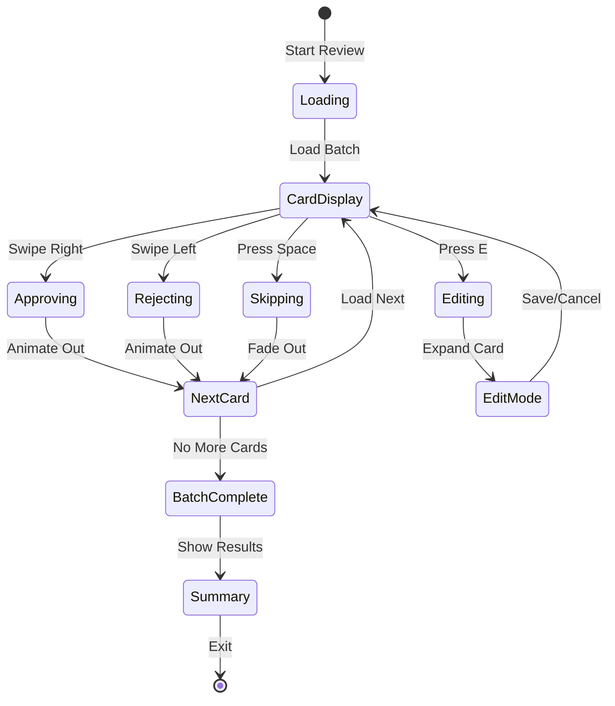

# Speed Review Interface Specification
## ContentMax Tinder-Style Content Review System

### Version 1.0
### Date: January 26, 2024
### Author: Sally (UX Expert)

---

## 1. Overview

The Speed Review Interface is a revolutionary content review system that transforms the traditionally tedious process of approving bulk-generated content into an engaging, efficient, and even enjoyable experience. Inspired by dating app interactions, this interface enables reviewers to process 100+ pieces of content per hour through intuitive gestures and keyboard shortcuts.

### Design Philosophy
- **Speed First**: Every interaction optimized for velocity
- **Cognitive Load Reduction**: Binary decisions (approve/reject) with edit escape hatch
- **Flow State**: Minimize context switching, maintain momentum
- **Gamification**: Make reviewing feel like progress, not work

---

## 2. Interface Layout

### 2.1 Full-Screen Takeover Mode

```
┌──────────────────────────────────────────────────────────────────┐
│  [←Exit]                ContentMax Speed Review          [Settings]│
├──────────────────────────────────────────────────────────────────┤
│                                                                   │
│  ┌─────────────────────────────────────────────────────────┐    │
│  │                    REVIEW PROGRESS                       │    │
│  │  ████████████████████░░░░░░░░░  67/100 (67%)           │    │
│  └─────────────────────────────────────────────────────────┘    │
│                                                                   │
│                        ┌──────────────┐                          │
│     ❌                 │              │                 ✓        │
│   REJECT               │   CONTENT    │             APPROVE      │
│   [R Key]              │    CARD      │             [A Key]      │
│     ←                  │              │                →         │
│   Swipe                │              │              Swipe       │
│                        └──────────────┘                          │
│                                                                   │
│                         [E] Edit                                 │
│                      [Space] Skip                                │
│                                                                   │
│  ┌─────────────────────────────────────────────────────────┐    │
│  │  Approved: 45  |  Rejected: 18  |  Edited: 4  |  Rate: 67/hr │
│  └─────────────────────────────────────────────────────────┘    │
└──────────────────────────────────────────────────────────────────┘
```

### 2.2 Content Card Structure

```
┌─────────────────────────────────────────────────────┐
│  Category: Winter Jackets                      95% AI│
│  ─────────────────────────────────────────────────  │
│                                                      │
│  💰 POTENTIAL IMPACT                                │
│  Search Volume: 45,000/mo → 68,000/mo (+51%)       │
│  Est. Traffic: +2,300 visits/mo                    │
│  Revenue Impact: +$47,000/mo                       │
│                                                      │
│  📊 SEO IMPROVEMENTS                                │
│  • Targets 12 new high-value keywords              │
│  • Adds FAQ schema (rich snippets opportunity)     │
│  • Improves content depth (450 vs 150 words)       │
│  • Internal links to 5 related categories          │
│                                                      │
│  ─────────────────────────────────────────────────  │
│                                                      │
│  <H1> Premium Winter Jackets for Cold Weather </H1> │
│                                                      │
│  Stay warm and stylish this winter with our         │
│  extensive collection of premium winter jackets.     │
│  From lightweight insulators to heavy-duty parkas,  │
│  we have the perfect jacket for every adventure...  │
│                                                      │
│  [... Preview continues ...]                        │
│                                                      │
│  ─────────────────────────────────────────────────  │
│  Language: EN | Template: Category | Words: 450     │
└─────────────────────────────────────────────────────┘
```

---

## 3. Interaction Mechanics

### 3.1 Primary Actions

#### APPROVE (Right)
**Triggers:**
- Keyboard: `A` key
- Mouse: Click green checkmark
- Touch: Swipe right
- Gesture: Two-finger swipe right (trackpad)

**Animation:**
- Card slides right with slight rotation (+15°)
- Green trail effect follows card
- Success sound: Soft "ding"
- Duration: 300ms ease-out
- Next card slides in from bottom (200ms)

#### REJECT (Left)
**Triggers:**
- Keyboard: `R` key  
- Mouse: Click red X
- Touch: Swipe left
- Gesture: Two-finger swipe left (trackpad)

**Animation:**
- Card slides left with slight rotation (-15°)
- Red trail effect follows card
- Reject sound: Subtle "whoosh"
- Duration: 300ms ease-out
- Next card slides in from bottom (200ms)

#### EDIT (Down)
**Triggers:**
- Keyboard: `E` key
- Mouse: Click Edit button
- Touch: Swipe down
- Gesture: Two-finger swipe down (trackpad)

**Behavior:**
- Card expands to full editor
- Transition: 400ms ease-in-out
- Editor appears with markdown/HTML toggle
- Auto-save every 5 seconds
- Quick approve after edit option

#### SKIP (Space)
**Triggers:**
- Keyboard: `Space` bar
- Mouse: Click Skip
- Touch: Long press
- Gesture: Pinch

**Behavior:**
- Card fades out (200ms)
- Marked for later review
- No impact on metrics
- Can review skipped items at end

### 3.2 Keyboard Shortcuts Map

| Key | Action | Context |
|-----|--------|---------|
| `A` | Approve | Main review |
| `R` | Reject | Main review |
| `E` | Edit | Main review |
| `Space` | Skip | Main review |
| `U` | Undo last | After action |
| `Tab` | Toggle view mode | Any time |
| `?` | Show help | Any time |
| `ESC` | Exit review | Any time |
| `1-5` | Quality rating | After approve |
| `F` | Flag for human | Any time |

---

## 4. SEO Intelligence Layer

### 4.1 Impact Prediction Panel

```
┌──────────────────────────────────────────────┐
│  📈 SEO IMPACT ANALYSIS                     │
├──────────────────────────────────────────────┤
│                                              │
│  BEFORE (Current State)                     │
│  • Monthly Search Volume: 45,000            │
│  • Current Position: #8                     │
│  • Click-Through Rate: 2.3%                 │
│  • Monthly Traffic: 1,035 visits            │
│                                              │
│  AFTER (With This Content)                  │
│  • Addressable Volume: 68,000 (+51%)        │
│  • Projected Position: #3-4                 │
│  • Expected CTR: 7.2%                       │
│  • Projected Traffic: 4,896 visits (+373%)  │
│                                              │
│  💰 REVENUE IMPACT                          │
│  • Conversion Rate: 2.1%                    │
│  • Average Order: $485                      │
│  • Monthly Revenue Lift: +$47,280          │
│  • Annual Impact: $567,360                  │
│                                              │
│  🎯 KEYWORD OPPORTUNITIES                   │
│  ┌────────────────────────┬────────┬──────┐│
│  │ New Keywords           │ Volume │ Diff ││
│  ├────────────────────────┼────────┼──────┤│
│  │ winter jacket brands   │ 12,000 │ Easy ││
│  │ warmest winter coats   │ 8,500  │ Med  ││
│  │ arctic parka reviews   │ 3,200  │ Easy ││
│  └────────────────────────┴────────┴──────┘│
└──────────────────────────────────────────────┘
```

### 4.2 Competitive Advantage Indicator

```
┌─────────────────────────────────────────┐
│  🏆 COMPETITIVE EDGE                    │
├─────────────────────────────────────────┤
│  Your Current Content: 150 words        │
│  Competitor Average: 875 words          │
│  This Content: 1,250 words              │
│                                         │
│  ████████████████████░░ 90% Better     │
│                                         │
│  Advantages Over Competitors:          │
│  ✓ FAQ Schema (only 2/10 have it)     │
│  ✓ Buying Guide Section (unique)       │
│  ✓ Size Calculator (differentiator)    │
│  ✓ 5 More Internal Links               │
└─────────────────────────────────────────┘
```

### 4.3 Quick SEO Scorecard

Each card shows a compact SEO score in the corner:

```
┌──────────────┐
│ SEO: A+ (92) │
│ ▲ +47K/mo   │
└──────────────┘
```

**Score Breakdown:**
- **A+ (90-100)**: Massive opportunity, approve immediately
- **A (80-89)**: Strong improvement, likely approve
- **B (70-79)**: Good improvement, review carefully
- **C (60-69)**: Modest gains, consider context
- **D (<60)**: Minimal impact, likely reject

### 4.4 Real-Time SERP Preview

```
┌───────────────────────────────────────────┐
│  Google Search Preview                   │
├───────────────────────────────────────────┤
│  🔍 winter jackets                       │
├───────────────────────────────────────────┤
│                                          │
│  yoursite.com › winter-jackets          │
│  Premium Winter Jackets - Stay Warm ... │
│  ⭐⭐⭐⭐⭐ Rating: 4.8 - 2,341 reviews    │
│  Price range: $149 - $899               │
│  In stock - Free shipping over $100     │
│                                          │
│  People also ask:                       │
│  • What is the warmest winter jacket?   │
│  • How do I choose a winter jacket?     │
│  • Are down jackets better than...      │
└───────────────────────────────────────────┘
```

---

## 5. Smart Features

### 4.1 AI Confidence Indicator

```
┌──────────────────────────────┐
│  AI Confidence: 95% 🟢      │
│  ████████████████████░░     │
│                              │
│  Auto-approve threshold: 90%│
│  [Adjust Threshold]          │
└──────────────────────────────┘
```

**Confidence Levels:**
- 95-100%: Green badge, auto-approve eligible
- 80-94%: Blue badge, likely good
- 60-79%: Yellow badge, review carefully
- <60%: Red badge, needs attention

### 4.5 SEO Priority Mode

Toggle to sort review queue by SEO impact:

```
┌─────────────────────────────────────────┐
│  REVIEW MODE: [Speed] [SEO Priority]   │
├─────────────────────────────────────────┤
│  Sorted by Revenue Impact:             │
│                                        │
│  1. Winter Jackets (+$47K/mo) 🔥       │
│  2. Ski Pants (+$31K/mo) 🔥            │
│  3. Snow Boots (+$28K/mo)              │
│  4. Winter Gloves (+$12K/mo)           │
│  5. Thermal Underwear (+$8K/mo)        │
│                                        │
│  Total Queue Value: $487K/mo           │
└─────────────────────────────────────────┘
```

### 4.6 Quick Impact Toggle

Press `I` to toggle between Content View and Impact View:

**Content View** (default):
Shows the actual content for quality review

**Impact View** (SEO focus):
Shows keywords targeted, search volume data, competitive gaps

### 4.2 Bulk Actions Mode

```
┌─────────────────────────────────────┐
│  BULK ACTIONS ENABLED              │
│  Select multiple cards:            │
│  □ Card 1 (95% confidence)        │
│  □ Card 2 (97% confidence)        │
│  □ Card 3 (93% confidence)        │
│  □ Card 4 (91% confidence)        │
│                                    │
│  [Approve All] [Reject All]        │
└─────────────────────────────────────┘
```

### 4.3 Comparison Mode

```
┌─────────────────────┬─────────────────────┐
│   ORIGINAL CONTENT  │  GENERATED CONTENT  │
├─────────────────────┼─────────────────────┤
│                     │                     │
│  Basic product      │  Premium Winter     │
│  description with   │  Jackets for Cold   │
│  minimal details    │  Weather Protection │
│                     │                     │
│  [Sparse content]   │  [Rich, detailed]   │
│                     │                     │
└─────────────────────┴─────────────────────┘
         [Use Original]  [Use Generated]
```

---

## 5. Review Flow States

### 5.1 Flow State Diagram



### 5.2 Progressive Loading

- **Preload**: Next 3 cards in background
- **Buffer**: Keep previous 2 cards in memory for undo
- **Batch Size**: 25 cards per batch (customizable)
- **Auto-save**: Every 10 decisions

---

## 6. Edit Mode Interface

### 6.1 Inline Editor

```
┌────────────────────────────────────────────────────┐
│  EDIT MODE                                [X Close]│
├────────────────────────────────────────────────────┤
│  [HTML] [Markdown] [Preview]              [AI Help]│
├────────────────────────────────────────────────────┤
│                                                    │
│  # Premium Winter Jackets for Cold Weather        │
│                                                    │
│  Stay warm and stylish this winter with our|      │
│  extensive collection of premium winter           │
│  jackets.                                         │
│                                                    │
│  ## Top Features                                  │
│  - Waterproof and breathable materials           │
│  - Insulation ratings from -10°F to -40°F        │
│                                                    │
├────────────────────────────────────────────────────┤
│  [AI Suggestions] [Grammar Check] [SEO Check]     │
├────────────────────────────────────────────────────┤
│  [Cancel]              [Save & Continue] [Approve] │
└────────────────────────────────────────────────────┘
```

### 6.2 Quick Edit Actions

- **Find & Replace**: Ctrl+F for bulk text changes
- **Template Swap**: Change content template
- **Regenerate Section**: AI regenerate specific parts
- **Add Schema**: Insert schema markup
- **Link Inspector**: View/edit internal links

---

## 7. Gamification & Motivation

### 7.1 Achievement System

```
┌─────────────────────────────────┐
│  🏆 Speed Demon                 │
│  Reviewed 100 items in 1 hour   │
│  +500 XP                        │
└─────────────────────────────────┘

┌─────────────────────────────────┐
│  🎯 Quality Guardian             │
│  95% approval accuracy          │
│  +300 XP                        │
└─────────────────────────────────┘
```

### 7.2 Performance Metrics

```
┌──────────────────────────────────────────┐
│  YOUR REVIEW STATS                      │
├──────────────────────────────────────────┤
│  Current Session                        │
│  Speed: 67 items/hour ↑                │
│  Accuracy: 94% ➜                       │
│  Edit Rate: 6% ↓                       │
│                                         │
│  Daily Goal: ████████░░ 80%            │
│  Weekly Rank: #3 of 12 reviewers       │
└──────────────────────────────────────────┘
```

### 7.3 Streak System

- **Daily Streak**: "5 days of consistent reviewing! 🔥"
- **Power Hour**: "3x XP for next 10 reviews!"
- **Perfect Run**: "10 reviews without skips!"

---

## 8. Adaptive Difficulty

### 8.1 Smart Queue Management

The system learns reviewer patterns and adjusts:

```python
if reviewer.accuracy > 95% and reviewer.speed > 80:
    # Give more complex content
    queue.add_complex_items()
    queue.increase_ai_threshold()
elif reviewer.accuracy < 85%:
    # Provide easier content
    queue.add_high_confidence_items()
    queue.show_comparison_mode()
```

### 8.2 Personalized Settings

```
┌─────────────────────────────────────┐
│  PERSONALIZE YOUR REVIEW           │
├─────────────────────────────────────┤
│  Card Size:     [S] [M] [L]       │
│  Font Size:     [──────●───]      │
│  Animation:     [●] On [ ] Off    │
│  Sound:         [●] On [ ] Off    │
│  Auto-approve:  [────●─────] 85%  │
│  Cards/batch:   [─────●────] 25   │
└─────────────────────────────────────┘
```

---

## 9. Mobile & Touch Optimization

### 9.1 Mobile Layout

```
┌─────────────────┐
│     67/100      │
│ ███████░░░ 67%  │
├─────────────────┤
│                 │
│                 │
│   CONTENT       │
│    CARD         │
│                 │
│                 │
├─────────────────┤
│  ❌   👁️   ✓   │
└─────────────────┘
```

### 9.2 Gesture Map

| Gesture | Action |
|---------|--------|
| Swipe Right | Approve |
| Swipe Left | Reject |
| Swipe Down | Edit |
| Pinch | Skip |
| Long Press | Preview full |
| Double Tap | Toggle view |

---

## 10. Accessibility Features

### 10.1 Screen Reader Support

```html
<div role="article" aria-label="Content review card 67 of 100">
  <h2>Category: Winter Jackets</h2>
  <div aria-live="polite">AI Confidence: 95%</div>
  <div role="main">
    <!-- Content preview -->
  </div>
  <nav aria-label="Review actions">
    <button aria-keyshortcuts="R">Reject</button>
    <button aria-keyshortcuts="A">Approve</button>
    <button aria-keyshortcuts="E">Edit</button>
  </nav>
</div>
```

### 10.2 Alternative Interfaces

**List Mode** (for users who prefer traditional review):
```
┌───────────────────────────────────────┐
│  □ Winter Jackets (95%)    [A][R][E] │
│  □ Summer Hats (87%)        [A][R][E] │
│  □ Running Shoes (91%)      [A][R][E] │
│  □ Yoga Mats (89%)          [A][R][E] │
│                                       │
│  [Select All] [Approve Selected]     │
└───────────────────────────────────────┘
```

---

## 11. Performance Optimization

### 11.1 Loading Strategy

```javascript
// Preload queue management
const queue = {
  current: cards[0],
  next: cards.slice(1, 4),     // Preload next 3
  previous: [],                 // Keep 2 for undo
  upcoming: cards.slice(4, 10)  // Lazy load next batch
}
```

### 11.2 Animation Performance

- **GPU Acceleration**: Transform3d for card movements
- **Will-change**: CSS hints for upcoming animations
- **RequestAnimationFrame**: Smooth 60fps animations
- **Reduced Motion**: Respect user preferences

---

## 12. Error Handling

### 12.1 Network Issues

```
┌─────────────────────────────────┐
│  ⚠️ Connection Issue            │
│  Your reviews are saved locally │
│  [Retry] [Work Offline]        │
└─────────────────────────────────┘
```

### 12.2 Recovery States

- **Auto-save**: Every 10 reviews to local storage
- **Session Recovery**: Resume exactly where left off
- **Conflict Resolution**: Handle simultaneous reviewers
- **Undo Buffer**: Last 10 actions reversible

---

## 13. Summary Screen

### 13.1 Session Complete

```
┌──────────────────────────────────────────────┐
│           SESSION COMPLETE! 🎉              │
├──────────────────────────────────────────────┤
│                                              │
│  REVIEW SUMMARY                            │
│  Total Reviewed:        100                 │
│  ├─ Approved:          67 (67%)            │
│  ├─ Rejected:          24 (24%)            │
│  ├─ Edited:            5 (5%)              │
│  └─ Skipped:           4 (4%)              │
│                                              │
│  SEO IMPACT UNLOCKED 💰                    │
│  ├─ Search Volume:     +487K/mo            │
│  ├─ Traffic Potential: +23,400 visits/mo   │
│  ├─ Revenue Impact:    +$412K/mo           │
│  └─ Annual Value:      $4.9M               │
│                                              │
│  TOP WINS                                  │
│  • Winter Jackets:     +$47K/mo            │
│  • Ski Equipment:      +$38K/mo            │
│  • Outdoor Gear:       +$31K/mo            │
│                                              │
│  PERFORMANCE                                │
│  Time:                 52 minutes           │
│  Speed:                115 items/hour 🔥    │
│  Accuracy Score:       94%                  │
│                                              │
│  XP Earned:            +1,250               │
│  Achievements:         Revenue Champion 🏆  │
│                                              │
│  [Review Skipped] [Export Report] [Exit]    │
└──────────────────────────────────────────────┘
```

---

## 14. Implementation Considerations

### 14.1 Technology Stack

- **Framework**: React with Next.js
- **Animations**: Framer Motion
- **Gestures**: Hammer.js or React-Use-Gesture
- **State**: Zustand for review state
- **Data**: Supabase real-time subscriptions

### 14.2 Data Model

```typescript
interface ReviewSession {
  id: string;
  userId: string;
  startTime: Date;
  endTime?: Date;
  items: ReviewItem[];
  stats: {
    approved: number;
    rejected: number;
    edited: number;
    skipped: number;
    averageTime: number;
  };
}

interface ReviewItem {
  id: string;
  contentId: string;
  decision: 'approved' | 'rejected' | 'edited' | 'skipped';
  timeSpent: number;
  edits?: string;
  confidence: number;
  timestamp: Date;
}
```

---

## 15. Success Metrics

- **Speed Target**: 100+ items/hour average
- **Accuracy**: 90%+ approval accuracy
- **Engagement**: 80% completion rate for batches
- **Satisfaction**: 4.5+ star rating
- **Adoption**: 95% of users prefer over traditional review

---

## Next Steps

1. Build interactive prototype for user testing
2. Create onboarding flow for first-time users
3. Design achievement and progression system
4. Develop A/B tests for gesture variations
5. Plan integration with taxonomy visualization